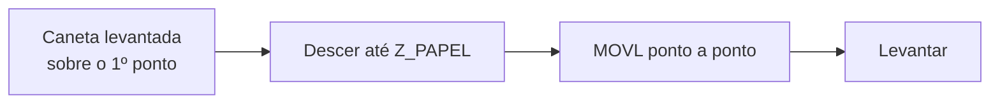

# 20. Estudo de caso: desenho por trajetória

!!! abstract "Objetivo"

    Gerar trajetórias geométricas em Python (círculo, polígono, estrela) e
    desenhá-las com a caneta, controlando caneta levantada e abaixada por Z.

| | |
|---|---|
| **Kit** | Escrita e desenho ([cap. 9](../operacao/desenho.md#91-instalando-o-kit-de-escrita-e-desenho)) |
| **Material** | Folha A4 presa com fita na mesa |
| **Conceitos** | MOVL, discretização de trajetória, latência de comunicação, workspace anular |

## 20.1 Medindo a altura do papel

1. Instale a caneta e prenda o papel.
2. Segure **Unlock** e desça a ponta até ela **encostar levemente** no papel.
3. Leia a pose com o `medir_pose.py` do [cap. 19](pick-and-place.md#193-ensinando-as-posicoes).
   O `z` lido é o `Z_PAPEL`.

!!! tip "Pressão da caneta"

    Use `Z_PAPEL` 0,5 a 1 mm **abaixo** do valor medido para garantir contato,
    mas não mais que isso: a caneta é rígida e pode rasgar o papel ou forçar o
    braço.

## 20.2 Gerando trajetórias

```python title="formas.py" linenums="1"
import math


def poligono(cx, cy, raio, lados, rot=0.0):
    """lados+1 pontos (o último repete o primeiro para fechar a forma)."""
    return [(cx + raio * math.cos(rot + 2 * math.pi * k / lados),
             cy + raio * math.sin(rot + 2 * math.pi * k / lados))
            for k in range(lados + 1)]


def circulo(cx, cy, raio, n=36):
    """Círculo aproximado por um polígono de n lados."""
    return poligono(cx, cy, raio, n)


def estrela(cx, cy, raio_ext, raio_int, pontas=5):
    pts = []
    for k in range(2 * pontas + 1):
        rr = raio_ext if k % 2 == 0 else raio_int
        ang = math.pi / 2 + math.pi * k / pontas
        pts.append((cx + rr * math.cos(ang), cy + rr * math.sin(ang)))
    return pts
```

## 20.3 Programa

```python title="desenhar.py" linenums="1"
from formas import circulo, estrela
from seguro import conectar

PORTA = "/dev/ttyUSB0"
Z_PAPEL = -48.0     # medido na seção 20.1 (mm)
Z_LEVANTADA = Z_PAPEL + 15
DZ_TESTE = 0        # use 30 para o "teste no ar"


def tracar(robo, pontos):
    """Leva a caneta ao 1º ponto levantada, desce, percorre e levanta."""
    x0, y0 = pontos[0]
    robo.move_to(x0, y0, Z_LEVANTADA + DZ_TESTE)
    robo.move_to(x0, y0, Z_PAPEL + DZ_TESTE)
    for x, y in pontos[1:]:
        robo.move_to(x, y, Z_PAPEL + DZ_TESTE)
    robo.move_to(*pontos[-1], Z_LEVANTADA + DZ_TESTE)


with conectar(PORTA) as robo:
    robo.speed(30, 30)
    tracar(robo, circulo(230, -40, 25, n=36))
    tracar(robo, estrela(230, 40, 25, 10))
```



## 20.4 Discussão

**Resolução × tempo.** Com o `pydobot`, cada comando custa cerca de 0,2 s
([cap. 17](../programacao/pydobot.md#latencia)). Um círculo com `n = 36`
leva uns 8 s só de comunicação; com `n = 360`, mais de 70 s. E cada segmento
MOVL **para** no ponto final antes do próximo, então o traço fica "facetado" e
com pequenas paradas.

**Movimento contínuo.** O protocolo da Dobot tem o modo **CP** (*continuous
path*), que interpola pontos sem parar em cada um. O `pydobot` tem apenas o
método interno `_set_cp_cmd(x, y, z)`, sem `wait`. Fica como exercício
avançado.

**Workspace anular.** Lembre do anel entre cerca de 200 e 320 mm de raio no
DobotLab ([fig. 9.2](../operacao/desenho.md)). Pontos muito perto da base são
inalcançáveis. A função `validar()` do [cap. 18](../programacao/boas-praticas.md#182-um-wrapper-defensivo)
recusa esses pontos antes de mover.

## 20.5 Exercícios

1. Desenhe o logotipo da sua equipe a partir de um SVG: use uma biblioteca como
   `svgpathtools` para amostrar pontos dos caminhos.
2. Escreva uma função `texto(...)` que desenhe letras com uma fonte de traço
   simples (*Hershey fonts*).
3. Compare um quadrado com 4 pontos e um com 40 pontos. Por que o canto do
   primeiro é mais nítido?
4. Implemente o mesmo desenho no **Writing and Drawing Lab** e compare tempo e
   qualidade.
