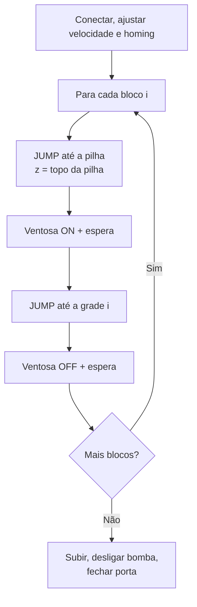

# 19. Estudo de caso: pick-and-place com ventosa

!!! abstract "Objetivo"

    Transferir N blocos de uma pilha para posições numa grade, usando a ventosa,
    o movimento JUMP e os padrões de código seguro.

| | |
|---|---|
| **Kit** | Ventosa + bomba de ar ([cap. 11](../operacao/teaching-playback.md#111-instalando-a-ventosa)) |
| **Material** | 4 blocos leves (≤ 500 g; cubos de espuma ou de madeira de 2 cm são ótimos) |
| **Conceitos** | JUMP, fila de comandos, ensino de pontos, avaliação de risco |
| **Código** | `magician.py` ([cap. 17](../programacao/pydobot.md#179-estendendo-a-biblioteca)) e `seguro.py` ([cap. 18](../programacao/boas-praticas.md#182-um-wrapper-defensivo)) |

## 19.1 Avaliação de risco rápida

| Perigo | Medida |
|---|---|
| Esmagamento da mão no workspace | Ninguém com a mão na bancada durante a execução; operador ao lado do PC. |
| Bloco arremessado ao soltar em velocidade alta | Velocidade ≤ 50%; soltar com o braço parado. |
| Alvo errado colidindo com a mesa | `validar()` com `Z_MIN` acima da mesa; ensaio e teste no ar. |
| Bomba ligada após o fim | `pump_off()` no `finally`. |

## 19.2 Fluxo



## 19.3 Ensinando as posições

Em vez de "chutar" coordenadas, **meça-as** no robô:

1. Com o robô ligado, segure **Unlock** e leve a ventosa até encostar no **bloco
   de cima** da pilha.
2. Rode o script abaixo e anote a pose.
3. Repita para o **primeiro ponto da grade de destino**.

```python title="medir_pose.py"
from pydobot import Dobot

robo = Dobot(port="/dev/ttyUSB0")
try:
    x, y, z, r, *_ = robo.pose()
    print(f"({x:.1f}, {y:.1f}, {z:.1f}, {r:.1f})")
finally:
    robo.close()
```

## 19.4 Programa

```python title="pick_and_place.py" linenums="1"
import time

from seguro import conectar

PORTA = "/dev/ttyUSB0"

# Posições medidas na seção 19.3 (mm). Atualize para a sua bancada!
PILHA_TOPO = (200.0, -80.0, 10.0)    # bloco de cima da pilha
ALTURA_BLOCO = 20.0                  # cada bloco baixa a pilha em 20 mm
GRADE_ORIGEM = (200.0, 30.0, -50.0)  # primeiro destino (sobre a mesa)
PASSO_GRADE = 35.0                   # distância entre destinos, em Y (último: y = 135)
N_BLOCOS = 4
ESPERA_VENTOSA = 0.5                 # s para a ventosa pegar ou soltar


def pick_and_place(robo):
    robo.jump_params(height=30, z_limit=100)
    robo.home()

    for i in range(N_BLOCOS):
        px, py, pz = PILHA_TOPO
        pz -= i * ALTURA_BLOCO                    # pilha diminui a cada bloco
        gx, gy, gz = GRADE_ORIGEM
        gy += i * PASSO_GRADE

        print(f"Bloco {i + 1}: ({px}, {py}, {pz}) → ({gx}, {gy}, {gz})")

        robo.jump_to(px, py, pz)                  # vai até o bloco
        robo.suck(True)
        time.sleep(ESPERA_VENTOSA)                # espera o vácuo formar

        robo.jump_to(gx, gy, gz)                  # leva até o destino
        robo.suck(False)
        time.sleep(ESPERA_VENTOSA)


if __name__ == "__main__":
    with conectar(PORTA, ensaio=False) as robo:   # comece com ensaio=True!
        robo.speed(40, 40)
        pick_and_place(robo)
```

!!! note "Por que `time.sleep` e não `robo.wait`?"

    Como `jump_to` usa `wait=True`, quando ele retorna o robô **já chegou**. A
    partir daí, `suck()` entra na fila e é executado logo. O `time.sleep`
    segura o script até a ventosa agir antes do próximo movimento. Com
    `robo.wait(500)` teríamos o mesmo efeito, mas dentro da fila do robô.

!!! warning "Primeira execução"

    1. `ensaio=True`: confira as coordenadas impressas.
    2. Ensaio real **sem blocos** e com `PILHA_TOPO` e `GRADE_ORIGEM` 40 mm mais altos.
    3. Só então rode com os blocos.

## 19.5 Variações e exercícios

1. **Paletização:** troque a linha de destinos por uma grade 2×2 e calcule `gx`
   e `gy` a partir de `i // 2` e `i % 2`.
2. **Rotação:** use o argumento `r` para girar cada bloco 90° antes de soltar.
3. **Trilho:** com o trilho deslizante, amplie a área de destino (requer
   comandos de trilho, que o `pydobot` não tem; procure os comandos *PTP with L*
   no protocolo de comunicação).
4. **Comparação:** cronometre o ciclo com `MOVL` (`move_to`) e com `JUMP`. Qual é
   mais rápido? Qual é mais seguro? Por quê?
5. **Colaborativo:** combine com o [cap. 21](sensor-io.md) para que o robô só
   pegue o próximo bloco quando um sensor indicar que a mão do operador saiu da
   área.
