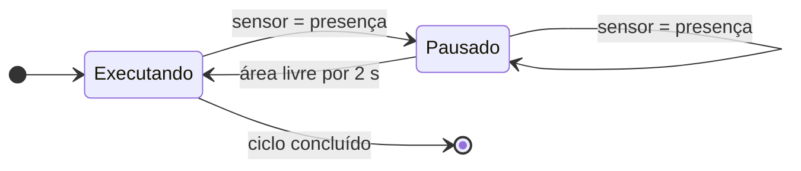

# 21. Estudo de caso: integração com sensor via I/O

!!! abstract "Objetivo"

    Ler um sensor de presença pelas entradas do Magician e usá-lo para **pausar
    o ciclo** quando alguém entra na área de trabalho. É uma simulação didática
    da parada monitorada de segurança.

| | |
|---|---|
| **Kit** | Ventosa (para o ciclo) + sensor digital de presença (ex.: módulo infravermelho de obstáculo, saída digital de 3,3 a 5 V) |
| **Interface** | **GP4** do antebraço: `5V`, `GND` e **EIO7** (entrada digital, pull-up de 1 MΩ) |
| **Conceitos** | Multiplexação de I/O, protocolo de comunicação, modos colaborativos |

!!! danger "Isto não é uma função de segurança"

    O que se constrói aqui é **didático**. Um sensor comum lido por software,
    entre um movimento e outro, **não** atende aos requisitos de uma parada
    monitorada de segurança: não tem redundância, diagnóstico nem tempo de
    resposta garantido. Continue mantendo as mãos fora do workspace.

## 21.1 Ligação elétrica

!!! warning "Desligue o robô antes de conectar"

    Conectar periféricos com o robô ligado pode danificá-lo
    ([cap. 6](../seguranca/procedimentos.md#62-precaucoes-especificas)).

| Sensor | Magician (GP4, antebraço) |
|---|---|
| VCC | 5V |
| GND | GND |
| OUT | ADC (**EIO7**): entrada digital de 3,3/5 V, pull-up de 1 MΩ |

A GP4 também é a porta do **nivelamento automático**. Desconecte o sensor antes
de usar essa função. Para deixar o sensor fixo na mesa, e não no antebraço, use
cabos de extensão.

## 21.2 Funções de I/O pelo protocolo

O `pydobot` não lê entradas ([cap. 17](../programacao/pydobot.md#get_eio-nao-le-entradas)).
As funções abaixo implementam três comandos do **Dobot Magician Communication
Protocol V1.1.5**:

| ID | Comando | Uso |
|---|---|---|
| 130 | Set IOMultiplexing | Escolhe a função do pino: 1 = PWM, 2 = saída digital, 3 = entrada digital, 4 = ADC |
| 133 | Get IODI | Lê uma entrada digital (0 ou 1) |
| 134 | Get IOADC | Lê uma entrada analógica (0 a 4095) |

```python title="io_magician.py" linenums="1"
"""Leitura de entradas do Magician (protocolo Dobot V1.1.5, IDs 130/133/134).

NÃO TESTADO no robô durante a redação. Valide com verbose=True e um sensor
conhecido antes de usar em um projeto.
"""
import struct

from pydobot.message import Message

IMMEDIATE = 0x01  # rw=1, isQueued=0
READ = 0x00       # rw=0, isQueued=0

IO_PWM, IO_DO, IO_DI, IO_ADC = 1, 2, 3, 4


def set_io_mode(robo, eio, funcao):
    msg = Message()
    msg.id = 130
    msg.ctrl = IMMEDIATE
    msg.params = bytearray([eio, funcao])
    robo._send_command(msg)


def read_di(robo, eio):
    """Retorna 0 ou 1. A resposta traz (endereço, nível)."""
    msg = Message()
    msg.id = 133
    msg.ctrl = READ
    msg.params = bytearray([eio])
    resp = robo._send_command(msg)
    return resp.params[1]


def read_adc(robo, eio):
    """Retorna de 0 a 4095. A resposta traz (endereço, valor uint16)."""
    msg = Message()
    msg.id = 134
    msg.ctrl = READ
    msg.params = bytearray([eio])
    resp = robo._send_command(msg)
    return struct.unpack_from("<H", resp.params, 1)[0]
```

!!! tip "Teste isolado primeiro"

    ```python
    import time
    from pydobot import Dobot
    from io_magician import set_io_mode, read_di, IO_DI

    robo = Dobot(port="/dev/ttyUSB0", verbose=True)
    try:
        set_io_mode(robo, 7, IO_DI)
        for _ in range(20):
            print("EIO7 =", read_di(robo, 7))   # aproxime e afaste a mão
            time.sleep(0.5)
    finally:
        robo.close()
    ```

    Se a leitura não mudar, confira as conexões, a lógica do sensor (muitos
    módulos infravermelhos dão **nível 0** quando detectam algo) e os pacotes
    impressos pelo `verbose`.

## 21.3 Ciclo com pausa por presença



```python title="ciclo_com_sensor.py" linenums="1"
import time

from io_magician import IO_DI, read_di, set_io_mode
from seguro import conectar

PORTA = "/dev/ttyUSB0"
EIO_SENSOR = 7
NIVEL_PRESENCA = 0        # módulo IR típico: 0 = obstáculo detectado
TEMPO_LIVRE = 2.0         # s de área livre antes de retomar

PONTOS = [(220, -60, 0), (220, 60, 0)] * 3   # vai e volta três vezes


def area_livre(robo):
    return read_di(robo, EIO_SENSOR) != NIVEL_PRESENCA


def aguardar_area_livre(robo):
    if area_livre(robo):
        return
    print("Presença detectada: pausado.")
    livre_desde = None
    while True:
        if area_livre(robo):
            livre_desde = livre_desde or time.monotonic()
            if time.monotonic() - livre_desde >= TEMPO_LIVRE:
                print("Área livre: retomando.")
                return
        else:
            livre_desde = None
        time.sleep(0.1)


with conectar(PORTA) as robo:
    robo.speed(30, 30)
    set_io_mode(robo, EIO_SENSOR, IO_DI)
    for x, y, z in PONTOS:
        aguardar_area_livre(robo)          # verifica antes de cada movimento
        robo.jump_to(x, y, z)
```

## 21.4 Discussão: o que falta para ser "de verdade"

| Requisito de uma parada monitorada real | Nesta implementação |
|---|---|
| Verificação contínua, inclusive **durante** o movimento | Só **entre** movimentos (`jump_to` bloqueia). |
| Tempo de resposta conhecido e garantido | Depende do SO, do Python e da serial (centenas de ms). |
| Sensor de segurança com diagnóstico e redundância | Sensor comum, um canal só. |
| Parada executada pelo **controlador** do robô | Parada decidida pelo **script** no PC. |
| Avaliação de risco e validação documentadas | Exercício didático. |

## 21.5 Variações e exercícios

1. **Sem código:** reproduza o comportamento no Teaching and Playback Lab com o
   gatilho **LEVEL INPUT** / *wait until* ([cap. 15](../operacao/io.md#153-entrada-digital-esperar-por-um-sinal)).
2. **Velocidade e separação (SSM) didático:** use um sensor de distância
   analógico numa entrada ADC (EIO9 em GP3 ou EIO15 em GP2) e reduza a
   velocidade com `speed()` conforme a distância diminui.
3. **Sinalização:** acenda um LED externo, por meio de transistor, numa saída
   digital (`set_eio`) enquanto o robô estiver pausado.
4. Reescreva a tabela 21.4 para um cobot industrial real da sua escolha: como
   cada linha é atendida?
