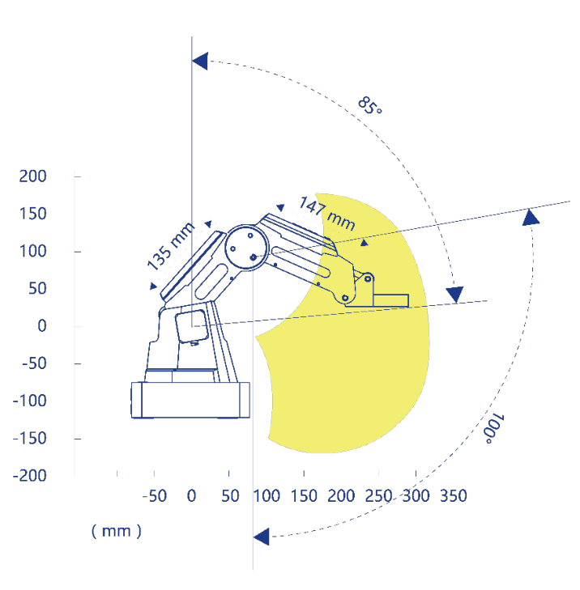
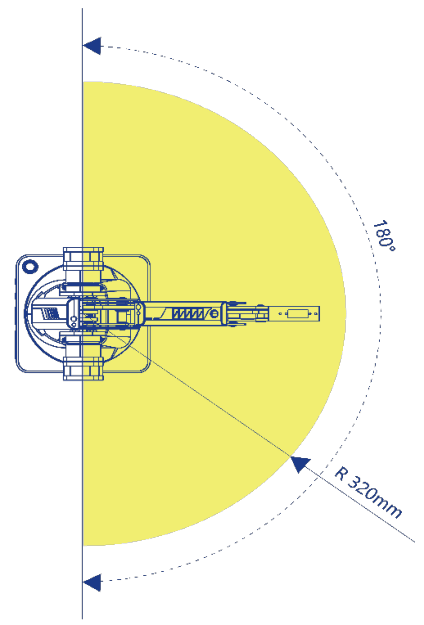
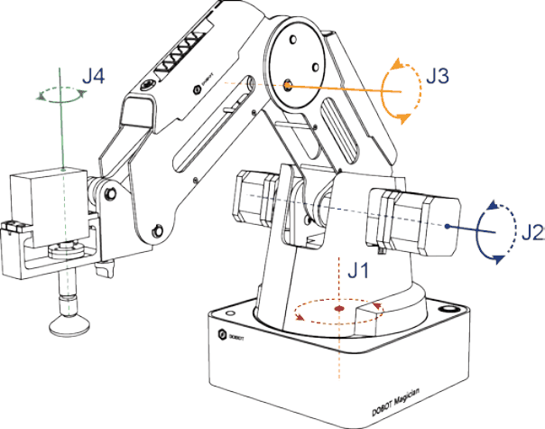
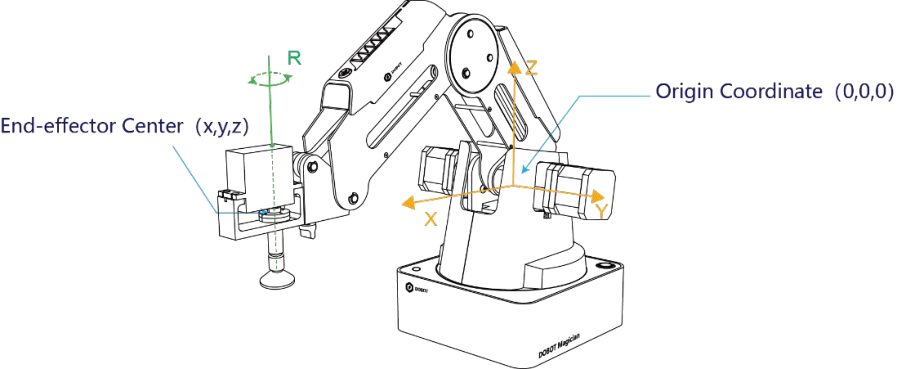
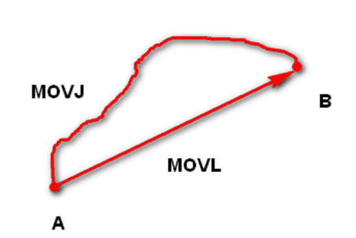
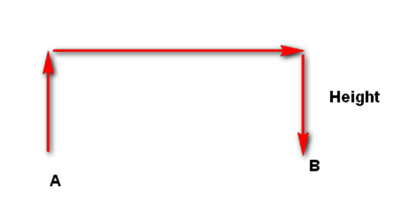
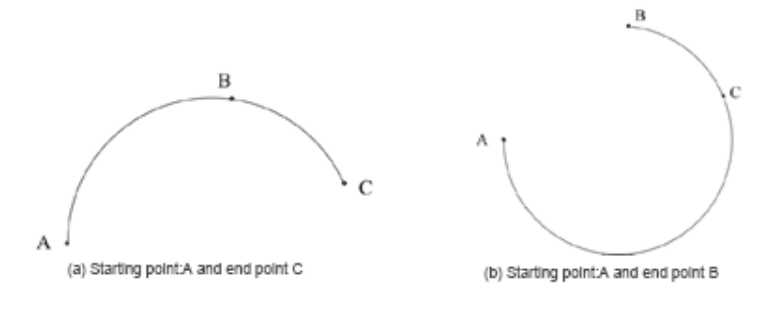

# 3. Cinemática, workspace e coordenadas

!!! abstract "Objetivos do capítulo"

    - Usar os sistemas de coordenadas de juntas e cartesiano do Magician.
    - Entender o espaço de trabalho (*workspace*) e seus limites.
    - Calcular a cinemática direta e a inversa do braço.
    - Escolher o modo de movimento certo: jog, MOVJ, MOVL, JUMP ou ARC.

## 3.1 Espaço de trabalho

O workspace é o conjunto de pontos que a ponta do robô consegue alcançar. No
Magician, ele é um volume em forma de "meia rosca": o alcance máximo é de
**320 mm** e a base gira **180°** (de −90° a +90°).

<div class="grid" markdown>

<figure markdown="span">
  { width="380" }
  <figcaption>Figura 3.1: Workspace em vista lateral. Braço traseiro de 135 mm e antebraço de 147 mm. Fonte: User Guide, fig. 2.2.</figcaption>
</figure>

<figure markdown="span">
  { width="250" }
  <figcaption>Figura 3.2: Workspace em vista superior, com raio de 320 mm e 180° de rotação da base. Fonte: User Guide, fig. 2.3.</figcaption>
</figure>

</div>

!!! warning "Ponto fora do workspace"

    Se um alvo estiver fora do workspace, o robô atinge a **posição limite**: o
    LED fica vermelho e o movimento é interrompido. No DobotLab, imagens fora
    da área de desenho ficam com borda vermelha. Em código, valide os alvos
    antes de enviar ([cap. 18](../programacao/boas-praticas.md)).

## 3.2 Sistemas de coordenadas

<div class="grid" markdown>

<figure markdown="span">
  { width="360" }
  <figcaption>Figura 3.3: Sistema de coordenadas de juntas. Fonte: User Guide, fig. 2.4.</figcaption>
</figure>

<figure markdown="span">
  { width="460" }
  <figcaption>Figura 3.4: Sistema de coordenadas cartesiano. Fonte: User Guide, fig. 2.5.</figcaption>
</figure>

</div>

**Coordenadas de junta**: definidas pelos ângulos das juntas, todas rotativas,
com sentido positivo anti-horário.

- Sem efetuador com servo: três juntas, **J1** (base), **J2** (braço traseiro) e **J3** (antebraço).
- Com efetuador com servo (ventosa, garra): quatro juntas, de **J1** a **J4**.

**Coordenadas cartesianas**: definidas a partir da base.

- **Origem**: centro dos três motores (base, braço traseiro e antebraço).
- **X**: perpendicular à base, para a frente.
- **Y**: perpendicular à base, para a esquerda.
- **Z**: vertical, para cima (regra da mão direita).
- **R**: orientação do servo do efetuador em relação à origem, com sentido
  positivo anti-horário. Só existe quando há um efetuador com servo.

!!! note "Z negativo é normal"

    Como a origem fica na altura dos motores, e não na mesa, pontos próximos da
    superfície de trabalho costumam ter **Z negativo** (por exemplo, −50 mm).

## 3.3 Cinemática direta

O Magician usa um **mecanismo de paralelogramo**: o motor do antebraço fica na
base e o antebraço mantém um ângulo **absoluto** em relação à horizontal.
Isso simplifica as equações.

Considere:

- `L1 = 135 mm` (braço traseiro), com `J2` medido a partir da **vertical**;
- `L2 = 147 mm` (antebraço), com `J3` medido a partir da **horizontal**;
- `d` = deslocamento horizontal da ferramenta, cerca de 60 mm para ventosa e
  caneta e cerca de 70 mm para o laser, conforme os valores observados no manual.

```text
ρ = L1·sen(J2) + L2·cos(J3) + d        (distância horizontal até o eixo da base)
z = L1·cos(J2) − L2·sen(J3)
x = ρ·cos(J1)
y = ρ·sen(J1)
r = J1 + J4
```

??? example "Verificação com os dados do manual"

    O painel de controle do braço (fig. 5.120 do manual) mostra
    `J1 = 0°`, `J2 = 58,15°`, `J3 = 57,05°` e a pose `X = 254,32`, `Z = −52,13`.
    Aplicando o modelo:

    ```text
    z = 135·cos(58,15°) − 147·sen(57,05°) = 71,24 − 123,37 = −52,13 mm  ✓
    ρ = 135·sen(58,15°) + 147·cos(57,05°) + d = 194,64 + d
    ⇒ d = 254,32 − 194,64 ≈ 59,7 mm
    ```

    Outros três registros do manual (figs. 5.39, 5.57 e 5.145) também batem com
    o modelo, com erro abaixo de 0,02 mm.

## 3.4 Cinemática inversa

O problema inverso é: dada uma pose `(x, y, z)`, quais ângulos levam a ponta até
ela? A base é resolvida direto, com `J1 = atan2(y, x)`. O braço vira um problema
plano de dois elos no plano `(ρ', z)`, com `ρ' = √(x² + y²) − d`.

```python title="cinematica.py"
import math

L1, L2 = 135.0, 147.0  # mm


def fk(j1, j2, j3, j4=0.0, d=60.0):
    """Cinemática direta. Ângulos em graus, distâncias em mm."""
    t1, t2, t3 = map(math.radians, (j1, j2, j3))
    rho = L1 * math.sin(t2) + L2 * math.cos(t3) + d
    z = L1 * math.cos(t2) - L2 * math.sin(t3)
    return rho * math.cos(t1), rho * math.sin(t1), z, j1 + j4


def ik(x, y, z, r=0.0, d=60.0):
    """Cinemática inversa (solução com o cotovelo para cima)."""
    j1 = math.degrees(math.atan2(y, x))
    rho = math.hypot(x, y) - d
    dist = math.hypot(rho, z)
    if not abs(L1 - L2) <= dist <= L1 + L2:
        raise ValueError("ponto fora do alcance geométrico")
    # alpha: ângulo do braço traseiro em relação à horizontal
    alpha = math.atan2(z, rho) + math.acos((L1**2 + dist**2 - L2**2) / (2 * L1 * dist))
    # beta: ângulo do antebraço em relação à horizontal
    beta = math.atan2(z - L1 * math.sin(alpha), rho - L1 * math.cos(alpha))
    j2 = 90.0 - math.degrees(alpha)
    j3 = -math.degrees(beta)
    return j1, j2, j3, r - j1


print(ik(254.32, 0, -52.13, d=59.68))  # ≈ (0.0, 58.16, 57.05, 0.0)
```

!!! warning "O modelo ignora os limites das juntas"

    A função `ik` só verifica o alcance **geométrico**. O controlador do robô
    também aplica os limites de cada junta (tabela do [cap. 2](magician.md))
    e restrições internas do paralelogramo. Um ponto com solução matemática
    ainda pode ser recusado pelo robô.

## 3.5 Modos de movimento

### Jog

Movimento manual pelos botões do painel de controle do braço, eixo a eixo:

- **Modo cartesiano**: `X+/X−`, `Y+/Y−`, `Z+/Z−` e `R+/R−`.
- **Modo de juntas**: `J1±` (base), `J2±` (braço traseiro), `J3±` (antebraço) e
  `J4±` (servo).

!!! note "R acompanha Y"

    Com um efetuador com servo instalado, o eixo R se move junto com Y no jog
    cartesiano, para manter constante a orientação da ferramenta em relação à
    origem.

### Ponto a ponto (PTP)

<div class="grid" markdown>

<figure markdown="span">
  { width="300" }
  <figcaption>Figura 3.5: MOVJ (trajetória livre) e MOVL (linha reta). Fonte: User Guide, fig. 2.6.</figcaption>
</figure>

<figure markdown="span">
  { width="380" }
  <figcaption>Figura 3.6: JUMP, trajetória em forma de "porta". Fonte: User Guide, fig. 2.7.</figcaption>
</figure>

</div>

- **MOVJ** (movimento de juntas): cada junta vai do ângulo inicial ao final sem
  controlar a trajetória cartesiana. É o modo mais rápido.
- **MOVL** (movimento linear): a ponta segue uma **linha reta** de A até B.
- **JUMP**: sobe até a altura de elevação (*Height*), anda na horizontal até
  ficar acima de B e desce até B. Os trechos são executados em MOVJ.

### ARC

Trajetória em **arco** definida por três pontos: o ponto atual, um ponto
qualquer do arco e o ponto final. Os três pontos não podem estar alinhados nem
coincidir, e o arco inteiro precisa estar dentro do workspace.

<figure markdown="span">
  { width="520" }
  <figcaption>Figura 3.7: Modo ARC. Fonte: User Guide, fig. 2.8.</figcaption>
</figure>

### Qual modo usar?

| Modo | Quando usar |
|---|---|
| MOVL | A trajetória precisa ser uma linha reta (desenho, encaixe). |
| MOVJ | A trajetória não importa, mas a velocidade sim. |
| JUMP | É preciso subir antes de deslocar: pegar e soltar objetos. |
| ARC | A trajetória precisa ser um arco (dispensação de cola, contornos). |

## 3.6 Exercícios

1. Com `d = 60 mm`, calcule a pose para `J1 = 30°`, `J2 = 45°`, `J3 = 45°`.
2. Use `ik` para encontrar os ângulos de `(200, 0, 0)`. Depois confira com `fk`.
3. Por que o JUMP é preferível ao MOVL para mover um objeto entre dois pontos
   sobre a mesa?
4. Compare o resultado de `fk` com o `pose()` do `pydobot` no robô real
   ([cap. 17](../programacao/pydobot.md)) e estime o `d` da sua ferramenta.

---

*Fonte: Dobot Magician User Guide V2.3.14, seção 2.3. As equações de cinemática
foram deduzidas da geometria do braço e verificadas com os valores exibidos nas
telas do manual.*
