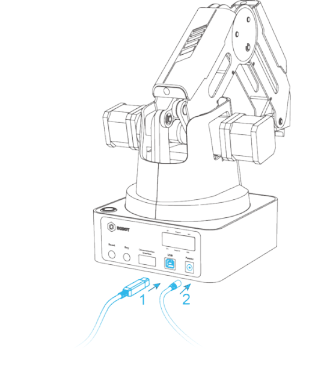
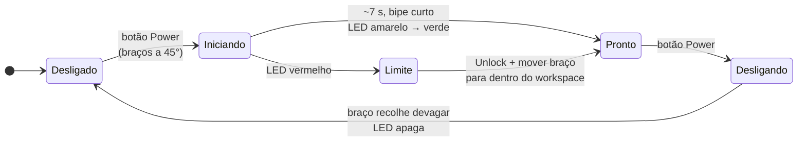
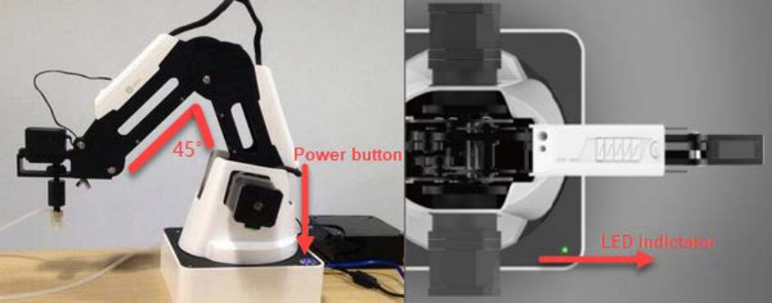
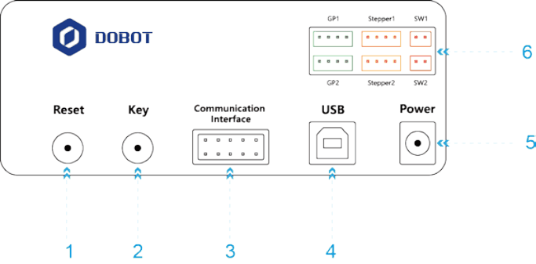
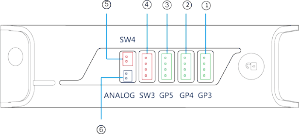
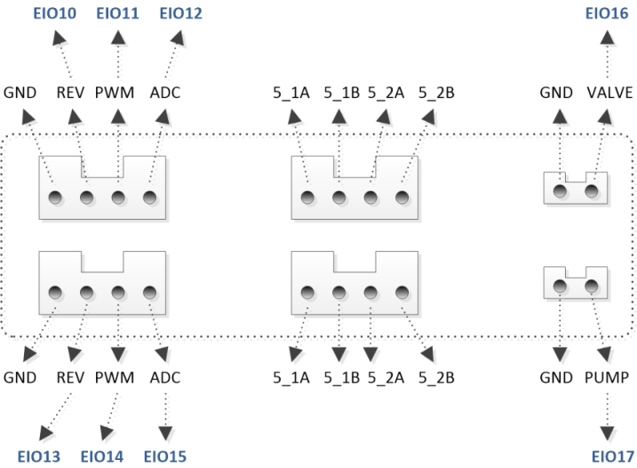
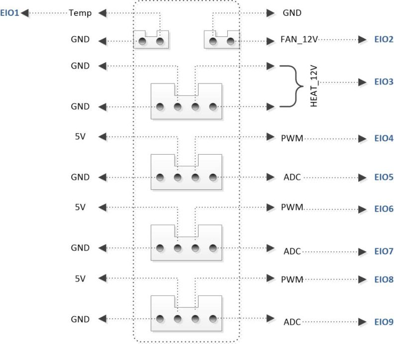
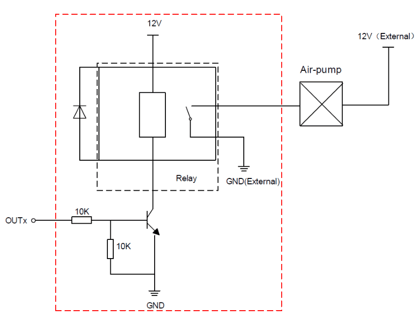

# 4. Conexão e interfaces

!!! abstract "Objetivos do capítulo"

    - Conectar, ligar e desligar o Magician corretamente.
    - Interpretar o LED indicador.
    - Conhecer as interfaces da base e do antebraço e o endereçamento das EIOs.

## 4.1 Conectando os cabos

Ligue o cabo **USB** do robô ao computador e a **fonte** de 12 V à entrada de
energia da base.

<figure markdown="span">
  { width="300" }
  <figcaption>Figura 4.1: Conexão do Magician ao computador. 1: USB; 2: energia. Fonte: User Guide, fig. 3.1.</figcaption>
</figure>

## 4.2 Ligando e desligando

**Para ligar:**

1. Coloque o braço na **posição neutra**: antebraço e braço traseiro formando
   um ângulo de cerca de **45°**.
2. Pressione o botão **Power** na base. O LED fica **amarelo** e os motores de
   passo travam.
3. Aguarde cerca de **7 segundos**. Um bipe curto soa e o LED fica **verde**: o
   robô está pronto.

<figure markdown="span">
  { width="560" }
  <figcaption>Figura 4.2: Postura antes de ligar, com ângulo de 45° entre os braços. Fonte: User Guide, fig. 3.2.</figcaption>
</figure>

!!! warning "LED vermelho ao ligar"

    O braço está na **posição limite**. Mantenha pressionado o botão **Unlock**
    no antebraço, mova o braço para dentro do workspace e solte.

**Para desligar:** com o LED verde, pressione o botão **Power**. O antebraço se
move devagar em direção ao braço traseiro até uma posição de repouso. Só
desconecte a energia **depois que o LED apagar completamente**.

!!! danger "Cuidado com as mãos no desligamento"

    O braço se move sozinho ao desligar. Mantenha as mãos fora do workspace.

## 4.3 LED indicador

| Estado do LED | Significado |
|---|---|
| Verde fixo | Funcionamento normal. |
| Amarelo fixo | Inicializando (ou reset em andamento). |
| Azul fixo | Modo offline. |
| Azul piscando | Homing ou nivelamento automático em andamento. |
| Vermelho fixo | Posição limite, alarme não limpo ou conexão anormal do kit de impressão 3D. |

## 4.4 Interfaces da base

<figure markdown="span">
  { width="560" }
  <figcaption>Figura 4.3: Interfaces na traseira da base. Fonte: User Guide, fig. 4.1.</figcaption>
</figure>

| Nº | Interface | Descrição |
|---|---|---|
| 1 | Reset | Reinicia o programa do microcontrolador. O LED fica amarelo; após cerca de 5 s, verde. |
| 2 | Key (tecla de função) | **Toque curto**: executa o programa offline. **Pressionar por 2 s**: inicia o homing. |
| 3 | Comunicação (UART) | Bluetooth, Wi-Fi etc., usando o protocolo Dobot. |
| 4 | USB | Conexão com o computador. |
| 5 | Power | Entrada da fonte. |
| 6 | Periféricos | Bomba de ar, extrusora, sensores etc. |

**Interfaces periféricas da base:**

| Interface | Uso |
|---|---|
| SW1 | Alimentação da bomba de ar; saída de 12 V controlável. |
| SW2 | Saída de 12 V controlável. |
| Stepper1 | Motor de passo livre; extrusora no modo de impressão 3D. |
| Stepper2 | Motor de passo livre. |
| GP1 | Sinal da bomba de ar; sensor de cor; sensor infravermelho; uso geral. |
| GP2 | Uso geral. |

## 4.5 Interfaces do antebraço

<figure markdown="span">
  { width="520" }
  <figcaption>Figura 4.4: Interfaces do antebraço. Fonte: User Guide, fig. 4.2.</figcaption>
</figure>

| Nº | Interface | Uso |
|---|---|---|
| 1 | GP3 | Efetuador; servo do eixo R; uso geral. |
| 2 | GP4 | Nivelamento automático; uso geral. |
| 3 | GP5 | Sinal do laser; uso geral. |
| 4 | SW3 | Hot end (impressão 3D); saída de 12 V controlável. |
| 5 | SW4 | Ventoinha (impressão 3D); alimentação do laser; saída de 12 V controlável. |
| 6 | ANALOG | Termistor (impressão 3D). |

## 4.6 I/O multiplexado (EIO)

Os endereços de I/O do Magician são **unificados** e numerados de **EIO1 a
EIO20**. A maioria dos pinos tem **várias funções** (saída digital, PWM,
entrada digital, ADC). A função ativa é escolhida por software, na
*multiplexação*.

=== "Base: periféricos"

    <figure markdown="span">
      { width="520" }
      <figcaption>Figura 4.5: Interface periférica da base. Fonte: User Guide, fig. 5.144.</figcaption>
    </figure>

    | Conector | Pino | EIO | Saída digital | PWM | Entrada digital | ADC | Pull |
    |---|---|---|---|---|---|---|---|
    | SW1 | VALVE | 16 | 12 V / 1 A | – | – | – | – |
    | SW2 | PUMP | 17 | 12 V / 1 A | – | – | – | – |
    | GP1 | REV | 10 | 5 V / 1 A | – | – | – | – |
    | GP1 | PWM | 11 | 3,3 V / 20 mA | ✓ | – | – | sem pull |
    | GP1 | ADC | 12 | – | – | 3,3/5 V, 20 mA | – | pull-up 1 MΩ |
    | GP2 | REV | 13 | 5 V / 1 A | – | – | – | – |
    | GP2 | PWM | 14 | 3,3 V / 20 mA | ✓ | 3,3/5 V, 10 mA | – | pull-up 1 MΩ |
    | GP2 | ADC | 15 | 3,3 V / 20 mA | – | 3,3/5 V, 20 mA | ✓ (máx. 5 V) | pull-down 1 MΩ |

    Stepper1 e Stepper2 fornecem, por padrão, 12 V / 0,9 A por fase.

=== "Base: UART"

    | Pino | EIO | Função |
    |---|---|---|
    | 5V | – | Saída de 5 V / 1 A |
    | E2 | 18 | Saída digital de 3,3 V / 20 mA (sem pull) |
    | E1 | 19 | Entrada de 3,3/5 V, 20 mA (pull-up 1 MΩ) |
    | nRST | – | Reset de hardware (entrada, pull-up 1 MΩ) |
    | STOP KEY | 20 | Entrada de 3,3/5 V, 20 mA (pull-up 10 kΩ) |
    | RX / TX | – | Recepção e transmissão UART |
    | GND | – | Terra |

=== "Antebraço"

    <figure markdown="span">
      { width="420" }
      <figcaption>Figura 4.6: Endereçamento do antebraço. Fonte: User Guide, fig. 4.5.</figcaption>
    </figure>

    | Conector | Pino | EIO | Saída digital | PWM | Entrada digital | ADC | Pull |
    |---|---|---|---|---|---|---|---|
    | ANALOG | Temp | 1 | – | – | – | – | pull-up 4,7 kΩ |
    | SW4 | FAN_12V | 2 | 12 V / 1 A | – | – | – | – |
    | SW3 | HEAT_12V | 3 | 12 V / 3 A | – | – | – | – |
    | GP5 | PWM | 4 | 3,3 V / 20 mA | ✓ | – | – | sem pull |
    | GP5 | ADC | 5 | – | – | 3,3/5 V, 20 mA | – | pull-up 1 MΩ |
    | GP4 | PWM | 6 | 3,3 V / 20 mA | ✓ | – | – | sem pull |
    | GP4 | ADC | 7 | – | – | 3,3/5 V, 20 mA | – | pull-up 1 MΩ |
    | GP3 | PWM | 8 | 3,3 V / 20 mA | ✓ | – | – | sem pull |
    | GP3 | ADC | 9 | – | – | 3,3/5 V, 20 mA | ✓ (máx. 5 V) | pull-down 1 MΩ |

!!! danger "Limites elétricos"

    - As saídas de 3,3 V suportam no máximo **20 mA**. Não ligue motores, relés
      nem LEDs de potência diretamente nelas.
    - A entrada **ADC** aceita no máximo **5 V**.
    - **Desligue o robô** antes de conectar ou desconectar qualquer equipamento
      externo (Bluetooth, Wi-Fi, joystick, sensores). Fazer isso com o robô
      ligado pode danificá-lo.

## 4.7 Ligando uma carga externa

Para acionar cargas maiores (uma bomba de ar externa, um solenoide), use a
saída de I/O apenas como **sinal** e um circuito de acionamento com fonte
própria, por exemplo transistor + relé:

<figure markdown="span">
  { width="520" }
  <figcaption>Figura 4.7: Exemplo de acionamento de bomba de ar com relé. "12 (I/O)" é a tensão da saída, OUTx é a saída de I/O e "12V (External)" é a fonte externa. Fonte: User Guide, fig. 4.10.</figcaption>
</figure>

---

*Fonte: Dobot Magician User Guide V2.3.14, capítulos 3 e 4.*
