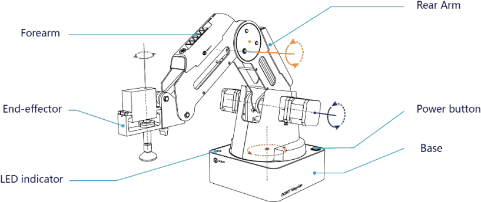

# 2. O Dobot Magician

!!! abstract "Objetivos do capítulo"

    - Identificar as partes do Magician.
    - Conhecer as especificações técnicas e os limites de operação.
    - Conhecer os efetuadores (ferramentas) disponíveis.

## 2.1 Visão geral

O Dobot Magician é um braço robótico **multifuncional de mesa**, criado para
ensino prático. Ele suporta:

- teaching & playback (ensinar e reproduzir movimentos);
- programação em blocos (Blockly) e por script (Python);
- escrita e desenho;
- gravação a laser;
- impressão 3D;
- desenvolvimento próprio, por meio de diversas interfaces de I/O.

## 2.2 Aparência

O Magician é composto por **base**, **braço traseiro** (*rear arm*),
**antebraço** (*forearm*) e **efetuador** (*end-effector*).

<figure markdown="span">
  { width="680" }
  <figcaption>Figura 2.1: Partes do Dobot Magician. Fonte: Dobot Magician User Guide V2.3.14, fig. 2.1.</figcaption>
</figure>

| Parte | Função |
|---|---|
| Base | Abriga a eletrônica, a junta J1 (rotação), o LED indicador e as interfaces traseiras. |
| Braço traseiro | Junta J2, com 135 mm de comprimento. |
| Antebraço | Junta J3, com 147 mm, mais o botão **Unlock** e as interfaces do antebraço. |
| Efetuador | Ferramenta na ponta: ventosa, garra, caneta, laser ou extrusora 3D. Os efetuadores com servo adicionam a junta J4. |

## 2.3 Especificações técnicas

| Parâmetro | Valor |
|---|---|
| Carga máxima | 500 g |
| Alcance máximo | 320 mm |
| Faixa da base (J1) | −90° a +90° |
| Faixa do braço traseiro (J2) | 0° a 85° |
| Faixa do antebraço (J3) | −10° a +90° |
| Rotação do efetuador (J4) | −90° a +90° |
| Velocidade máxima de braço traseiro, antebraço e base (com carga de 250 g) | 320 °/s |
| Velocidade máxima do servo (com carga de 250 g) | 480 °/s |
| Repetibilidade | 0,2 mm |
| Alimentação | 100–240 V CA, 50/60 Hz |
| Entrada de energia | 12 V / 7 A CC |
| Comunicação | USB, Wi-Fi, Bluetooth |
| I/O | 20 interfaces de I/O extensíveis |
| Software | DobotLab |
| Temperatura de operação | −10 °C a 60 °C |

!!! note "Repetibilidade não é precisão absoluta"

    0,2 mm é a **repetibilidade**: a capacidade de voltar ao mesmo ponto. A
    precisão absoluta (acertar uma coordenada informada) depende da calibração
    ([cap. 13](../operacao/calibracao.md)) e do efetuador.

## 2.4 Efetuadores

| Efetuador | Uso | Conexão principal | Capítulo |
|---|---|---|---|
| Ventosa (padrão) | Pegar objetos leves e planos | Servo em GP3; bomba de ar em GP1 + SW1 | [11](../operacao/teaching-playback.md) |
| Garra pneumática | Pegar objetos pequenos | Igual à ventosa | [11](../operacao/teaching-playback.md) |
| Caneta / pincel | Escrita e desenho | Fixação mecânica | [9](../operacao/desenho.md) |
| Laser | Gravação em papel e madeira | SW4 (energia) + GP5 (sinal TTL) | [10](../operacao/laser.md) |
| Extrusora 3D | Impressão 3D | Stepper1, SW3, SW4, ANALOG | [12](../operacao/impressao-3d.md) |

Acessórios adicionais: trilho deslizante (*sliding rail*), joystick (*stick
controller kit*), sensores infravermelho e de cor, módulos Bluetooth e Wi-Fi.

## 2.5 Software

O Magician é operado pelo **DobotLab** (<https://dobotlab.dobot.cc/>), uma
plataforma web que precisa do **DobotLink** instalado no computador para falar
com o hardware ([cap. 7](../operacao/dobotlab.md)). Para programar em Python
fora do DobotLab, use a biblioteca `pydobot` ([cap. 17](../programacao/pydobot.md)).

---

*Fonte: Dobot Magician User Guide V2.3.14, seções 2.1, 2.2 e 2.4.*
