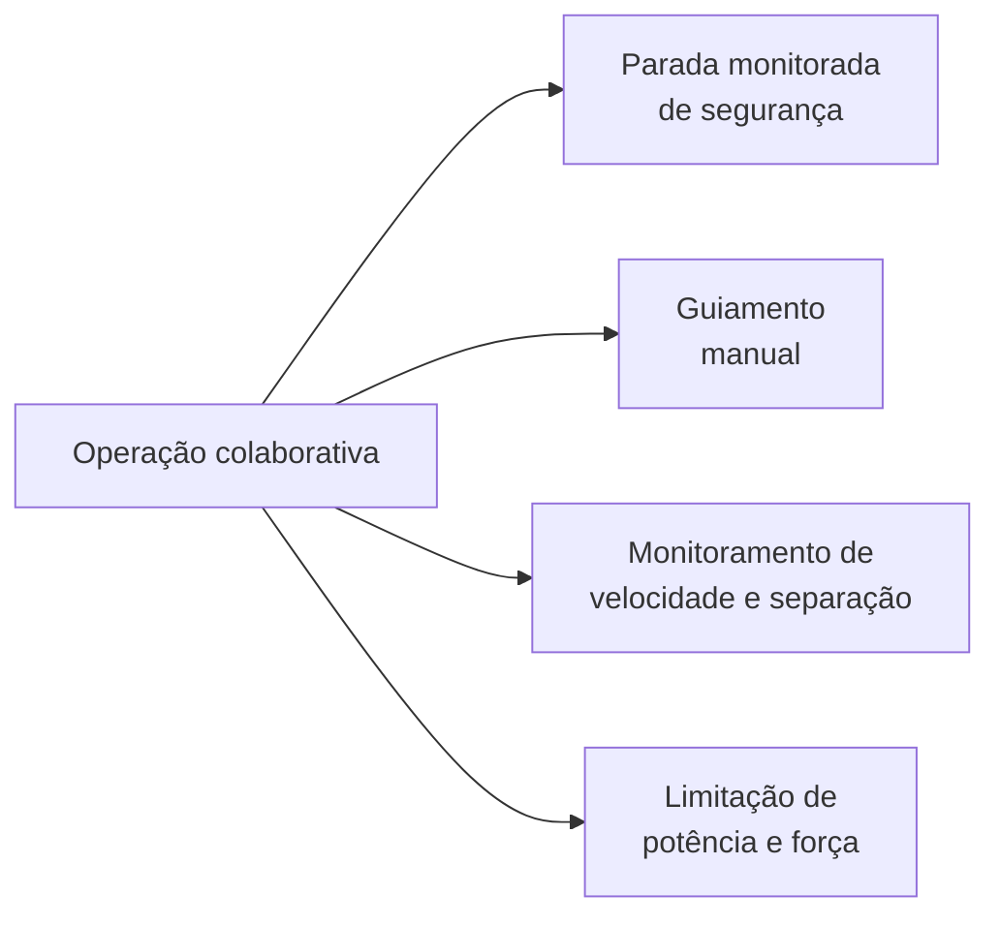

# 1. Robótica colaborativa

!!! abstract "Objetivos do capítulo"

    - Diferenciar robô industrial tradicional, robô colaborativo e **aplicação colaborativa**.
    - Conhecer os quatro modos de operação colaborativa definidos pelas normas.
    - Entender os níveis de interação entre pessoa e robô.
    - Situar o Dobot Magician nesse contexto.

## 1.1 Do robô enjaulado ao robô ao lado

Por décadas, o robô industrial típico trabalhou **isolado**: cercas, portas
intertravadas e cortinas de luz garantiam que nenhuma pessoa entrasse na célula
enquanto o robô se movia. A segurança vinha da **separação física**.

A robótica colaborativa muda essa premissa. Pessoa e robô passam a compartilhar
o mesmo espaço de trabalho, e a segurança deixa de depender só da separação.
Ela passa a depender de **como o robô se move** (velocidade, força, distância)
e de **como a tarefa é projetada**.

O termo *cobot* foi proposto em 1996 por J. Edward Colgate e Michael Peshkin,
da Northwestern University, para descrever dispositivos que manipulam objetos
**em colaboração** com um operador humano.[^colgate]

## 1.2 O que é colaborativo é a aplicação

Um ponto central das normas é que **não existe robô seguro por si só**. Um braço
com sensores de força, carregando uma faca, continua perigoso. Por isso, as
normas falam em **aplicação colaborativa**: a combinação de robô, ferramenta,
peça, tarefa e ambiente, avaliada como um todo.

!!! tip "Para lembrar"

    "Robô colaborativo" é uma característica de projeto do equipamento.
    "Aplicação colaborativa" é o que precisa ser avaliado quanto ao risco.

## 1.3 Níveis de interação

Uma forma comum de classificar a relação entre pessoa e robô é pelo quanto os
dois compartilham **espaço** e **tempo**:

| Nível | Espaço de trabalho | Momento | Exemplo |
|---|---|---|---|
| Célula isolada | Separado | Separado | Robô de solda atrás de cerca |
| Coexistência | Compartilhado | Separado | Pessoa entra na área só quando o robô para |
| Cooperação | Compartilhado | Simultâneo, tarefas diferentes | Robô aparafusa enquanto a pessoa abastece peças |
| Colaboração | Compartilhado | Simultâneo, mesma tarefa | Pessoa e robô seguram a mesma peça |

## 1.4 Os quatro modos de operação colaborativa

As normas de segurança de robôs (ISO 10218 e a antiga ISO/TS 15066, hoje
incorporada à ISO 10218 revisada em 2025) descrevem quatro modos de operação
colaborativa. Uma aplicação pode combinar mais de um.

| Modo | Ideia principal | Exemplo |
|---|---|---|
| **Parada monitorada de segurança** (*safety-rated monitored stop*) | O robô para, de forma monitorada, sempre que a pessoa entra no espaço colaborativo, e retoma quando ela sai. | Operador posiciona uma peça; o robô aguarda parado. |
| **Guiamento manual** (*hand guiding*) | A pessoa conduz o robô com as mãos, por um dispositivo de guiamento, para ensinar ou executar o movimento. | Ensinar pontos arrastando o braço. |
| **Monitoramento de velocidade e separação** (*speed and separation monitoring*, SSM) | Sensores medem a distância até a pessoa; o robô reduz a velocidade ou para antes que a distância mínima seja violada. | Scanner de área reduz a velocidade quando alguém se aproxima. |
| **Limitação de potência e força** (*power and force limiting*, PFL) | O contato pode acontecer, mas a força e a pressão sobre o corpo ficam abaixo de limites definidos por avaliação biomecânica. | Cobot que para ao encostar no braço do operador. |

!!! note "Valores normativos"

    Os limites de força, pressão e velocidade são definidos nas normas e dependem
    da região do corpo, do tipo de contato e da avaliação de risco. Consulte o
    texto oficial das normas antes de projetar uma aplicação real; este ebook não
    reproduz essas tabelas.

## 1.5 Onde o Magician se encaixa

O Magician não é um cobot industrial certificado, mas reproduz em pequena
escala várias situações da robótica colaborativa. Isso o torna uma boa
plataforma de estudo:

| Conceito colaborativo | Como aparece no Magician |
|---|---|
| Guiamento manual | Botão **Unlock** no antebraço: você segura o botão, move o braço com a mão e solta para gravar o ponto ([cap. 11](../operacao/teaching-playback.md)). |
| Parada e retomada | Comando *wait*, pausa no DobotLab e tecla **Key** no modo offline. |
| Monitoramento | **Detecção de perda de passo** (*lost step*): o robô para e acende o LED vermelho quando detecta perda de passo do motor. |
| Integração com sensores | Entradas digitais e analógicas multiplexadas, sensores infravermelho e de cor ([cap. 15](../operacao/io.md)). |
| Baixa energia | Carga máxima de 500 g, motores de passo pequenos e alcance de 320 mm. |

!!! warning "Isso não substitui a segurança real"

    Nenhum desses recursos é uma **função de segurança certificada**. A
    detecção de perda de passo, por exemplo, protege a **precisão** do robô, não
    o operador. Mantenha as mãos fora da área de trabalho durante a execução,
    como manda o manual.

## 1.6 Exercícios

1. Classifique em níveis de interação: (a) uma impressora 3D cartesiana; (b) o
   Magician fazendo pick-and-place enquanto você observa; (c) você ensinando
   pontos com o botão Unlock.
2. Para cada modo colaborativo da tabela 1.4, descreva que sensor ou função o
   Magician precisaria ter para implementá-lo de verdade.
3. Por que as normas avaliam a **aplicação** e não o **robô**? Dê um exemplo com
   o Magician em que a ferramenta muda o risco da aplicação.

[^colgate]: J. E. Colgate, W. Wannasuphoprasit e M. A. Peshkin, "Cobots: Robots
    for collaboration with human operators", *Proceedings of the ASME Dynamic
    Systems and Control Division*, 1996.
