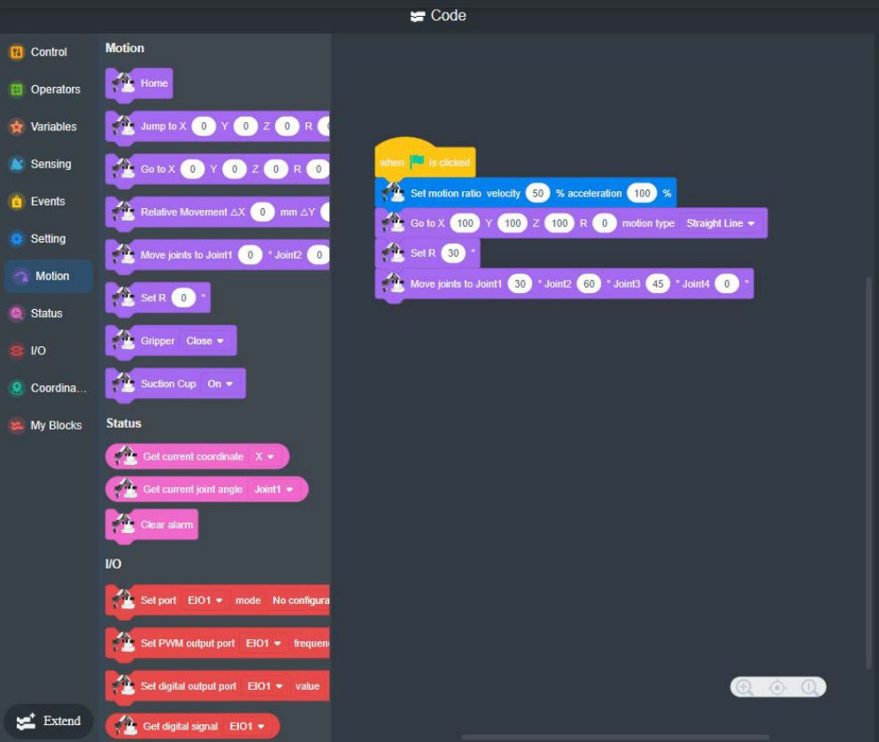

# 8. Programação em blocos (Blockly)

!!! abstract "Objetivos do capítulo"

    - Criar um programa em blocos no DobotBlock Lab.
    - Entender os blocos de movimento, de status e de I/O.
    - Usar sprites e cenários para criar programas interativos.

O **DobotBlock Lab** foi pensado para quem está começando a programar: você
arrasta blocos para controlar o movimento do Magician.

**Pré-requisito:** Magician ligado e com o DobotLink em execução.

## 8.1 Criando o programa

1. Na página inicial do DobotLab, clique em **DobotBlock Lab**.
2. Clique no ícone de dispositivo e escolha **Magician** na página "Choose a Device".
3. *(Opcional)* Clique em **Extend**, no canto inferior esquerdo da área de
   blocos, para abrir "Choose an Extension". Adicione as extensões de que
   precisar: **Sliding Rail Kit**, **Photoelectric & Color Sensor** ou
   **AI Extension**. Clique em **Add extension**.
4. Clique no ícone de conexão na aba **Magician**.
5. Clique em **Connect**. Com a conexão feita, aparecem **Connected**,
   **Disconnect** e **Go to Editor**.
6. Monte o programa na área de código:
    - ajuste os parâmetros de cada bloco;
    - todo programa precisa de um **evento de disparo**. Por exemplo, o bloco
      *"when green flag clicked"* faz o programa rodar quando você clica na
      bandeira verde.

<figure markdown="span">
  { width="680" }
  <figcaption>Figura 8.1: Programa em blocos com velocidade, movimento e rotação. Fonte: User Guide, fig. 5.10.</figcaption>
</figure>

### Blocos principais

| Categoria | Blocos (exemplos) |
|---|---|
| **Motion** | `Home`, `Jump to X Y Z R`, `Go to X Y Z R` (com tipo de movimento), `Relative Movement ΔX ΔY ΔZ`, `Move joints to`, `Set R`, `Gripper`, `Suction Cup` |
| **Status** | `Get current coordinate`, `Get current joint angle`, `Clear alarm` |
| **I/O** | `Set port EIOx mode`, `Set PWM output port`, `Set digital output port`, `Get digital signal`, `Get analog signal` |
| **Setting** | Velocidade e aceleração (`Set motion ratio velocity … acceleration …`) |
| **Events / Control** | Bandeira verde, laços, condições e esperas |

## 8.2 Sprites e cenários (opcional)

O DobotBlock Lab é baseado no Scratch e permite combinar o robô com
**sprites** (personagens) e **cenários** (*backdrops*). É útil para criar
programas interativos, como um botão na tela que dispara um movimento.

1. Na aba **Sprite**, clique no ícone de sprite e escolha um da lista.
2. Com o sprite selecionado, clique em **Extend** para adicionar extensões, como
   Music, Pen, Video Sensing, Text to Speech, Translate e Makey Makey.
3. Clique no ícone de cenário e escolha um *backdrop*. Você também pode enviar
   ou desenhar o seu.
4. Arraste os blocos para a área de código para controlar sprite e cenário.

## 8.3 Exercício

Monte um programa que:

1. ajuste a velocidade para 30%;
2. vá para `(200, 0, 50)`;
3. faça um **JUMP** para `(200, 100, 0)`, ligue a ventosa, espere 1 s e volte
   para `(200, 0, 50)`;
4. desligue a ventosa.

Depois compare com a versão em Python do [cap. 19](../casos/pick-and-place.md).

---

*Fonte: Dobot Magician User Guide V2.3.14, seção 5.3.*
