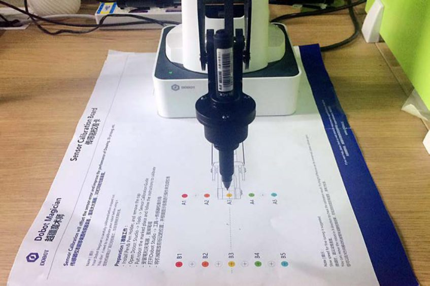

# 13. Calibração e homing

!!! abstract "Objetivos do capítulo"

    - Saber quando recalibrar o encoder da base e os sensores de ângulo.
    - Executar o nivelamento manual e o automático.
    - Fazer o homing e definir um ponto de origem próprio.

O Magician sai calibrado de fábrica. Com o uso, impactos e perda de passo podem
afetar a precisão. Esta tabela ajuda a escolher o procedimento:

| Sintoma | Procedimento |
|---|---|
| Depois do homing, **J1 ≠ 0°** (erro de 1° a 3°) | [Calibração da base](#131-calibracao-da-base) |
| **Z muda** ao mover o robô num mesmo plano horizontal | [Calibração dos sensores](#132-calibracao-dos-sensores) (nivelamento) |
| O robô levou uma **pancada** ou **perdeu passo** | [Homing](#133-homing) |

## 13.1 Calibração da base

Depois do homing, J1 deveria ser **0°**, com o antebraço centralizado à frente
da base. Se não for, recalibre o encoder da base.

**Pré-requisitos:** kit de escrita instalado; robô ligado e conectado ao
DobotLab; DobotLink em execução; **placa de calibração de sensores** em mãos.

1. Posicione o Magician na marcação da placa de calibração.

    <figure markdown="span">
      { width="460" }
      <figcaption>Figura 13.1: Magician posicionado na placa de calibração. Fonte: User Guide, fig. 5.114.</figcaption>
    </figure>

2. *(Opcional)* Defina o ponto de origem para observar a ponta na placa:
    1. abra o **Teaching and Playback Lab** e conecte o Magician;
    2. com **Unlock**, encoste a ponta da caneta na placa e solte. O ponto
       aparece na área de comandos;
    3. clique com o botão direito no comando e escolha **Set Home**.
3. Abra o **DobotLink** e clique em **Enter** no módulo **Machine Calibration**.
4. Clique em **Connect** na janela que aparece.
5. Clique em **Start calibration** no módulo **Base calibration**.
6. Clique em **Ready, next step**. O robô faz o homing; mantenha o workspace
   **livre de obstáculos**.
7. Use **+J1** e **−J1** para levar a ponta a um ponto **sobre a linha entre A3 e
   B3** da placa. Se estiver rápido demais, reduza a velocidade no controle
   deslizante.
8. Clique em **Adjusted, confirm calibration**. Confira o J1 no painel de
   controle do braço.

## 13.2 Calibração dos sensores

Os sensores de ângulo do braço traseiro e do antebraço também saem calibrados
de fábrica. Se Z variar ao mover o braço num mesmo plano, recalibre:

| Método | Recursos | Indicado para |
|---|---|---|
| **Nivelamento manual** | DobotLink, placa de calibração e kit de escrita | Aplicações que exigem **precisão absoluta** alta. |
| **Nivelamento automático** | DobotLink e ferramenta de nivelamento automático | Aplicações sem exigência alta, como desenho e impressão 3D. É mais rápido. |

=== "Nivelamento manual"

    **Pré-requisitos:** robô ligado e conectado; DobotLink em execução; placa
    de calibração.

    1. Posicione o Magician na placa de calibração.
    2. No DobotLink, clique em **Enter** em **Machine Calibration**.
    3. Clique em **Connect**.
    4. Clique em **Start calibration** em **Manual Levelling**.
    5. Clique em **Ready, next step**. O robô se move e faz a compensação
       automática dos coeficientes dos sensores.

        !!! warning "Sem efetuador"
            Remova todos os efetuadores antes deste passo.

    6. Instale a caneta ([cap. 9](desenho.md#91-instalando-o-kit-de-escrita-e-desenho))
       e clique em **Ready, next step**.
    7. Ajuste X, Y e Z pelos botões até a ponta ficar sobre o **primeiro ponto**
       (por exemplo, **A3**). Clique em **Ready, next step**.
    8. Ajuste até o **segundo ponto** (por exemplo, **B3**). Clique em **Ready,
       next step**.
    9. Mantenha a distância entre os pontos em **80 mm**, o valor da placa.

        !!! warning "Não arraste o braço"
            Neste passo, mova o robô só pelos botões. Arrastar com a mão faz o
            nivelamento falhar.

    10. Clique em **Complete calibration**.

=== "Nivelamento automático"

    **Pré-requisitos:** robô conectado ao PC por USB e à fonte; DobotLink em
    execução; ferramenta de nivelamento automático.

    1. Coloque o Magician numa **superfície plana**. Se a superfície não for
       plana, o nivelamento falha.
    2. Fixe a ferramenta de nivelamento na ponta com o parafuso de fixação.
    3. Ligue o cabo da ferramenta na interface **GP4** do antebraço.
    4. Ligue o Magician.
    5. No DobotLink, clique em **Enter** em **Machine Calibration**.
    6. Clique em **Start calibration** em **Auto Levelling**.
    7. Clique em **Ready, next step**. O nivelamento leva cerca de **2 minutos**.
       Mantenha o workspace livre de obstáculos.

## 13.3 Homing

Faça o homing quando o robô levar uma **pancada** ou **perder passo**.

1. Clique em **Home** no painel de controle do braço. Como alternativa, mantenha
   a tecla **Key** da base pressionada por 2 s.
2. O braço gira no sentido horário até o limite e volta à origem padrão. O LED
   **pisca azul**.
3. Ao terminar, há um **bipe** e o LED fica **verde**.

!!! warning "Antes do homing"

    - Remova o efetuador.
    - Garanta que não há obstáculos no workspace.

**Origem personalizada:** no Teaching and Playback Lab, clique com o botão direito
num ponto salvo e escolha **Set Home**.

---

*Fonte: Dobot Magician User Guide V2.3.14, seção 5.9.*
