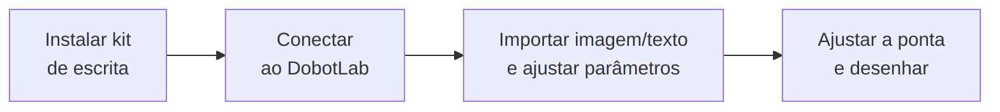
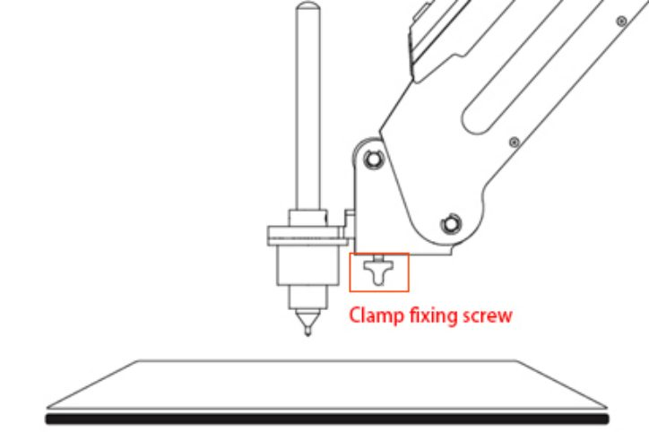
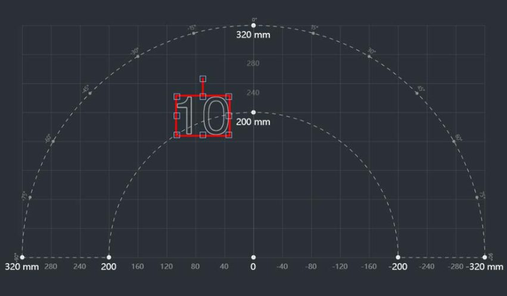
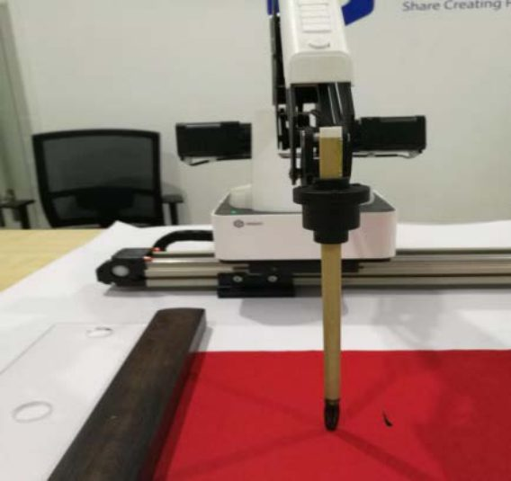

# 9. Escrita e desenho

!!! abstract "Objetivos do capítulo"

    - Instalar o kit de escrita e desenho.
    - Desenhar uma imagem ou texto com o Writing and Drawing Lab.
    - Usar o trilho deslizante para áreas maiores, como na caligrafia com pincel.

## 9.1 Instalando o kit de escrita e desenho

O kit é composto por uma **caneta** e um **suporte de caneta**.

1. Coloque a caneta no suporte.
2. Fixe o kit na ponta do Magician com o **parafuso de fixação** (*clamp fixing
   screw*).
3. Coloque uma folha de papel sobre a superfície de trabalho, dentro do
   workspace.

<figure markdown="span">
  { width="440" }
  <figcaption>Figura 9.1: Fixação do kit de escrita. Fonte: User Guide, fig. 5.21.</figcaption>
</figure>

!!! note "Trocar a caneta"

    Afrouxe os quatro parafusos M3×5 do suporte com uma chave Allen de 1,5 mm.

## 9.2 Desenhando sem trilho

=== "1. Conectar"

    1. Na página inicial do DobotLab, clique em **Writing and Drawing Lab**.
    2. No painel de conexão, escolha **Magician** e clique em **Connect**.

=== "2. Importar e configurar"

    1. Digite um texto na caixa (por exemplo, `10`) e clique em **Add**. O
       gráfico aparece na área de desenho.
        - Para uma imagem, clique em **Open** e escolha o arquivo. Se não for
          SVG, a janela "SVG Format Conversion" pede a escala de conversão;
          clique em **OK**.
    2. Arraste o gráfico para a posição desejada. Posição, tamanho, rotação e
       espelhamento ficam nas configurações no canto superior esquerdo.
    3. Clique em **Settings** para definir a **altura de levantamento da caneta**
       (*pen lifting height*), a **altura de descida** (*descent height*) e a
       **velocidade**. Em geral, 20 e 20 funcionam bem.
    4. Mantenha **Unlock** pressionado e abaixe o braço até a ponta **encostar
       levemente** no papel. Você também pode descer Z devagar pelo jog. Clique
       em **Auto Z** para gravar a altura atual.
    5. Clique em **Synchronize** para levar a ponta até o início do desenho.

    <figure markdown="span">
      { width="560" }
      <figcaption>Figura 9.2: A imagem precisa ficar dentro da área anular (entre 200 e 320 mm). Fora dela, fica com borda vermelha. Fonte: User Guide, fig. 5.26.</figcaption>
    </figure>

=== "3. Desenhar"

    1. Clique em **Running program**. O cursor mostra a posição da ponta em
       tempo real e o progresso aparece abaixo da área de desenho. Use **Pause**
       ou **Stop** quando precisar.
    2. *(Opcional)* Clique em **Save** e dê um nome ao projeto para salvá-lo em
       *My Works*.
    3. *(Opcional)* Clique em **Download** para gravar o arquivo no robô.

!!! note "Synchronize é opcional"

    Sem **Synchronize**, o desenho sai normalmente: ao clicar em **Running
    program**, o braço vai direto ao ponto inicial.

## 9.3 Instalando o trilho deslizante

Quando o workspace não basta, o **trilho deslizante** (*sliding rail kit*)
amplia o alcance. Ele é útil para pick-and-place de longa distância e para
caligrafia em faixas longas.

1. Fixe o Magician na **placa a** com quatro parafusos escareados M3×10 (o
   rebaixo da placa fica para fora).
2. Fixe a placa a, já com o robô, na **placa b** com três parafusos Allen M3×8.
   A traseira da base fica voltada para o rebaixo da placa b.
3. Prenda a ponta do chicote de cabos na placa b com um parafuso escareado M3×6.
4. Conecte a ponta do chicote ao Magician.
5. Conecte a outra ponta do chicote à **fonte**, ao **USB do PC**, à **interface
   do motor** e à **interface de homing** do trilho.

## 9.4 Escrevendo com trilho

**Pré-requisitos:** trilho instalado e conectado; robô ligado e conectado ao
DobotLab; kit de escrita instalado; tinta, pedra de tinta (*inkstone*) e papel
preparados.

1. **Conectar:** abra o Writing and Drawing Lab e conecte o **Magician**.
2. **Habilitar o trilho:** marque **Rail** no painel de controle do braço.
   Teste com `L+` / `L−`. Depois clique em **Home**: o trilho vai para a origem
   e em seguida o robô faz o homing.

    !!! warning "Antes do Home"
        Retire a caneta ou levante o braço antes de clicar em **Home**.

3. **Importar:** digite o texto (por exemplo, "AI Application") e clique em
   **Add**, ou abra uma imagem com **Open**.
    - Se a imagem aparecer invertida, espelhe-a.
    - Para escrever numa **ordem definida**, importe uma imagem com a ordem dos
      pontos. Texto digitado é escrito da esquerda para a direita.
    - A imagem precisa ficar dentro da **área retangular**.
4. **Configurar:** em **Settings**, defina as alturas e a velocidade.
5. **Ajustar Z:** com **Unlock**, abaixe o pincel até tocar o papel e clique em
   **Auto Z**.

    <figure markdown="span">
      { width="320" }
      <figcaption>Figura 9.3: Altura do pincel no papel. Fonte: User Guide, fig. 5.43.</figcaption>
    </figure>

6. *(Opcional)* **Molhar o pincel na tinta automaticamente:**
    1. Clique com o botão direito na área de desenho e escolha **Add Trigger
       Line**. Uma linha azul aparece; arraste-a para a posição desejada. Ao
       cruzar essa linha, o pincel vai até a pedra de tinta.
    2. Abra a página **Trigger Trajectory**.
    3. Com **Unlock**, leve o antebraço sobre a área de escrita e solte para
       gravar o primeiro ponto. Esse ponto deve ficar **alto**, para o pincel
       não bater na pedra.
    4. Leve o braço até a pedra de tinta e grave os pontos do movimento de
       molhar.
    5. Levante o pincel para não arrastar na pedra. Em **Settings**, a altura
       de subida recomendada é de **50 a 70 mm**.
7. Clique em **Synchronize** e depois em **Running program**. Salve ou faça
   o download se quiser.

---

*Fonte: Dobot Magician User Guide V2.3.14, seção 5.5.*
