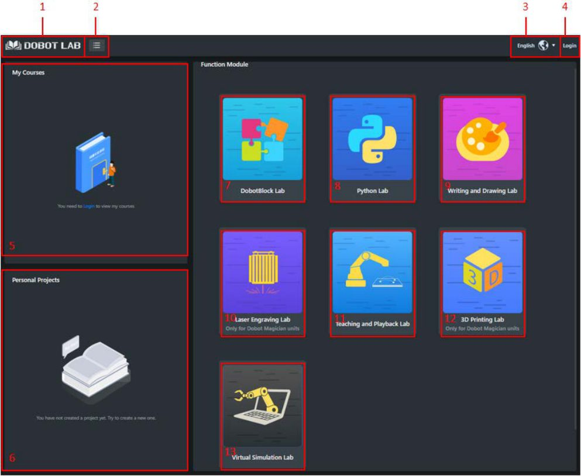
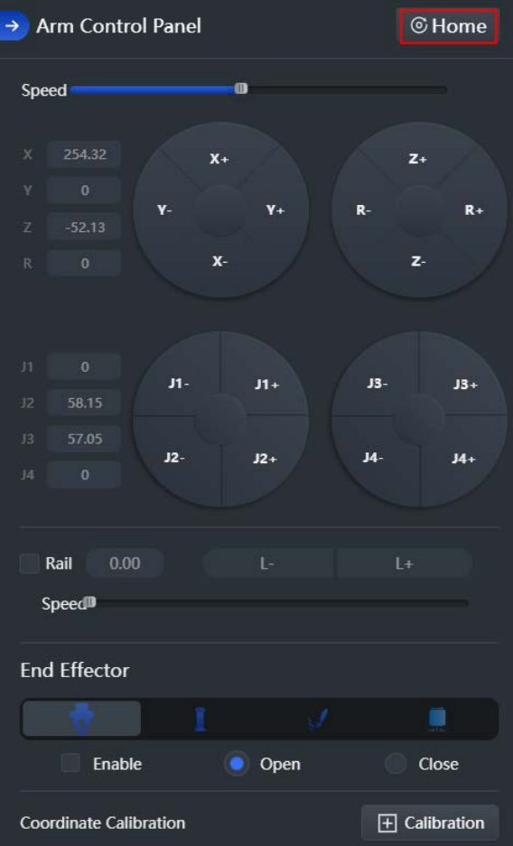

# 7. DobotLab e DobotLink

!!! abstract "Objetivos do capítulo"

    - Conhecer os módulos (*labs*) do DobotLab.
    - Instalar e iniciar o DobotLink.
    - Conectar o Magician ao DobotLab.

## 7.1 DobotLab

O **DobotLab** é a plataforma de software da Dobot para educação em IA e
robótica. Ele reúne todas as funções do Magician: teaching & playback, escrita
e desenho, programação em blocos, scripts etc. Acesse em
<https://dobotlab.dobot.cc/>.

<figure markdown="span">
  { width="680" }
  <figcaption>Figura 7.1: Página inicial do DobotLab. Fonte: User Guide, fig. 5.1.</figcaption>
</figure>

| Módulo | Função |
|---|---|
| **DobotBlock Lab** | Programação em blocos (Blockly). Veja o [cap. 8](blockly.md). |
| **Python Lab** | Programação por script em Python. Veja o [cap. 16](../programacao/python-dobotlab.md). |
| **Writing and Drawing Lab** | Escrita e desenho. Veja o [cap. 9](desenho.md). |
| **Laser Engraving Lab** | Gravação de imagens bitmap a laser. Veja o [cap. 10](laser.md). |
| **Teaching and Playback Lab** | Ensinar e reproduzir movimentos. Veja o [cap. 11](teaching-playback.md). |
| **3D Printing Lab** | Impressão 3D. Veja o [cap. 12](impressao-3d.md). |
| **Virtual Simulation Lab** | Simulação do robô em cena virtual. |
| My Course / Personal Works | Cursos online e projetos salvos. |

A barra superior também tem o **menu** (guia de uso, ajuda, feedback e "sobre"),
a seleção de **idioma** e o **login**.

## 7.2 Instalando e iniciando o DobotLink

O **DobotLink** é o *driver* que permite ao DobotLab, que roda no navegador,
falar com o hardware. Ele precisa estar **instalado e em execução** antes de
você usar o robô.

Ao abrir o DobotLab sem o DobotLink, aparece a janela **"DobotLink is not
started"**:

1. Se você **ainda não instalou**, clique no botão de download e instale seguindo
   as instruções.
2. Se **já instalou**, clique no botão para iniciar. Aparecem as janelas
   "DobotLink is starting" e "Open DobotLink?".
3. Clique em **Open DobotLink**. A mensagem **"DobotLink started successfully"**
   confirma que tudo está pronto.

## 7.3 Conectando o robô

Todos os labs usam o mesmo procedimento de conexão:

1. Ligue o robô e espere o LED **verde** ([cap. 4](../fundamentos/conexao-interfaces.md#42-ligando-e-desligando)).
2. Abra o lab desejado.
3. Abra a lista do painel de conexão de dispositivos e escolha **Magician**.
4. Clique em **Connect**. O painel passa a mostrar **"Connected COMx"** e um
   botão **Disconnect**.

!!! tip "Porta serial"

    No Windows, a porta aparece como `COM3`, `COM4` etc. No macOS e no Linux,
    como `/dev/tty.usbserial-*` ou `/dev/ttyUSB*`. Se nada aparecer, confira o
    cabo USB e o driver do conversor USB-serial do robô.

## 7.4 Painel de controle do braço

Quase todos os labs têm o **Arm Control Panel**, que você vai usar o tempo todo:

<figure markdown="span">
  { width="300" }
  <figcaption>Figura 7.2: Painel de controle do braço. Fonte: User Guide, fig. 5.133.</figcaption>
</figure>

- **Speed**: velocidade do jog.
- **X, Y, Z, R / J1–J4**: pose atual e botões de jog cartesiano e de juntas.
- **Home**: executa o homing.
- **Rail**: habilita o trilho deslizante (`L+` / `L−`).
- **End Effector**: escolhe a ferramenta (ventosa, garra, caneta, laser) e o
  estado dela.
- **Coordinate Calibration**: calibração de coordenadas.

---

*Fonte: Dobot Magician User Guide V2.3.14, seções 5.1 e 5.2.*
