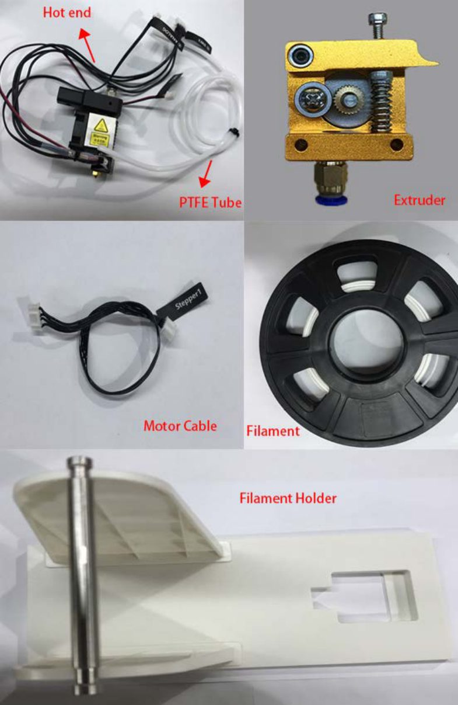
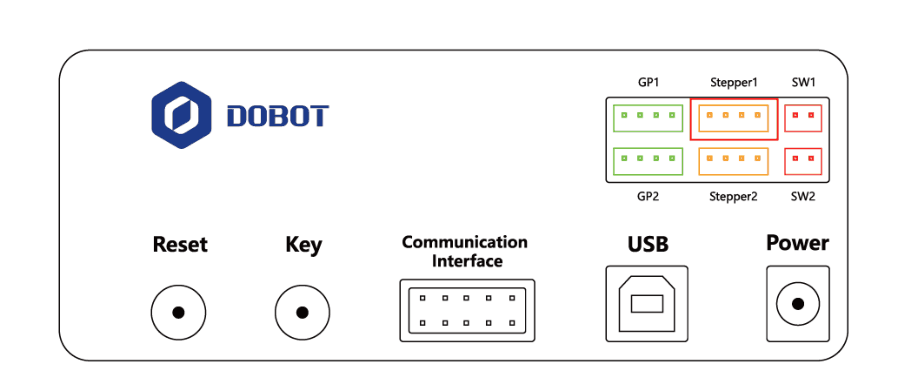

# 12. Impressão 3D

!!! abstract "Objetivos do capítulo"

    - Montar o kit de impressão 3D.
    - Gravar o firmware de impressão 3D.
    - Configurar e imprimir com o Repetier Host ou o Cura.

!!! danger "Perigo: alta temperatura"

    O hot end chega a **250 °C**. Não toque nele, não deixe crianças por perto,
    supervisione toda a impressão e desligue o equipamento ao terminar.

| Software | Características |
|---|---|
| **Repetier Host** | Fatia com motores externos (CuraEngine, Slic3r etc.), permite ver e editar o G-code e controlar a impressão manualmente. Mais parâmetros, mais flexível. |
| **Cura** | Fatiamento rápido e estável, tolerante a modelos complexos, com menos parâmetros. |

!!! note "Sistema operacional"

    O manual descreve o processo no **Windows**. No **macOS**, só o **Cura** é
    suportado.

## 12.1 Montando o kit

O kit tem **extrusora**, **hot end**, **cabo do motor**, **filamento** e
**suporte de filamento**.

<figure markdown="span">
  { width="360" }
  <figcaption>Figura 12.1: Kit de impressão 3D. Fonte: User Guide, fig. 5.76.</figcaption>
</figure>

1. Pressione a alavanca da extrusora e empurre o filamento pela polia até o
   fundo do furo.
2. Ligue uma ponta do **tubo de PTFE** ao hot end (empurrando até o fundo) e a
   outra à extrusora.
3. Insira o filamento no tubo de PTFE até o fundo do hot end.

    !!! warning "PTFE até o fundo"
        Se o tubo de PTFE não estiver encostado no fundo do hot end, a extrusão
        fica irregular.

4. Fixe o hot end no Magician com o parafuso de fixação.
5. No antebraço, ligue o cabo de **aquecimento** na interface **4 (SW3)**, o da
   **ventoinha** na **5 (SW4)** e o do **termistor** na **6 (ANALOG)**.
6. Ligue a extrusora à interface **Stepper1**, na traseira da base, com o cabo
   do motor.
7. Coloque o filamento e a extrusora no suporte.

<figure markdown="span">
  { width="520" }
  <figcaption>Figura 12.2: A extrusora vai na interface Stepper1 da base. Fonte: User Guide, fig. 5.81.</figcaption>
</figure>

## 12.2 Gravando o firmware

O Magician usa um **firmware específico** para impressão 3D.

1. Na página inicial do DobotLab, clique em **3D Printing Lab**. Uma janela
   pergunta se o firmware de impressão 3D já foi gravado.
2. Se **já foi**, confirme que você tem um software de impressão instalado. O
   link de download do Repetier Host aparece na janela
   (`https://download.dobot.cc/3D/RepetierHost.zip`).
3. Se **não foi**, clique em **no**. Na janela **Firmware Update**:
    1. escolha **Magician** (a porta é selecionada automaticamente) e clique em
       **Connect**;
    2. em **Firmware Type**, escolha **3D Print Firmware**;
    3. clique em **Select Firmware** e depois em **Start Upgrading**.

!!! danger "Durante a gravação"

    **Não opere nem desligue** o Magician durante a gravação do firmware. Se as
    coordenadas ficarem estranhas depois, reinicie o robô.

## 12.3 Imprimindo

**Pré-requisitos:** modelo 3D pronto, em formato **STL**; plataforma de
impressão dentro do workspace; robô ligado e conectado por **USB** (a única
conexão suportada); kit instalado.

=== "Repetier Host"

    1. Abra o **Repetier Host**.
    2. **Configure a impressora** (só na primeira vez) em **Printer Settings**:

        | Aba | Configuração |
        |---|---|
        | Connection | Port: a porta do robô (ex.: `COM4`); Baud Rate: `115200`; Transfer Protocol: `Autodetect`; Reset on Connect: `DTR low->high->low`; Reset on Emergency: `Send emergency command and reconnect`; Receive Cache Size: `63` |
        | Printer | **Desmarque** "Go to Park Position after Job/Kill", "Disable Motors after Job/Kill" e "Printer has SD card" |
        | Extruder | Diameter: `0.4` mm (máx. extrusora 250 °C) |
        | Printer Shape | Printer Type: `Rostock Printer (circular print shape)`; Home X/Y: `Min`; Home Z: `0`; Printable Radius: `80` mm; Printable Height: `150` mm |

        Clique em **Apply** em cada aba e depois em **OK**.

    3. Clique em **Connect**. A temperatura atual aparece na parte de baixo da
       janela.
    4. **Teste a extrusora:**
        1. na aba **Manual Control**, ajuste a temperatura para **200 °C** e
           ligue o aquecimento (a impressão só começa acima de 170 °C);
        2. a 200 °C, alimente de **10 a 30 mm** de filamento. Se o filamento
           derretido sair pelo bico, a extrusora está funcionando. Se sair ao
           contrário, retire o filamento, vire a extrusora e insira de novo;
        3. coloque **fita crepe** na plataforma para a primeira camada aderir;
        4. com **Unlock**, desça o bico até a fita, deixando a folga da
           espessura de uma folha A4;
        5. digite **`M415`** na janela de G-code (ou pressione **Key** na
           base) para registrar a coordenada atual. Se a janela de G-code não
           aparecer, clique em **EASY** para sair do modo fácil.
    5. Clique em **Load** e escolha o modelo STL. Em **Object Placement**, você
       pode centralizar, escalar e girar.
    6. **Fatiamento** (primeira vez): na aba **Slicer**, escolha **Slic3r** e
       clique em **Configuration**. Em **File > Load Config**, carregue o perfil
       de exemplo da Dobot, disponível na *Download Center* do site:
       `Dobot-2.0-Vase.ini` para vasos de parede fina ou `Dobot-2.0.ini` para
       peças com 20% de preenchimento. Salve as abas Print, Filament e Printer
       Settings.
    7. Clique em **Slice with Slic3r** e depois em **Print**. O robô vai até a
       origem de impressão e começa.

=== "Cura"

    Use o Cura **V14.07**, a versão recomendada pelo manual.

    1. Em **Machine > Machine settings**, configure:

        | Parâmetro | Valor |
        |---|---|
        | Maximum width | 80 mm |
        | Maximum depth | 80 mm |
        | Maximum height | 150 mm |
        | Machine center 0,0 | Marcado |
        | GCode Flavor | RepRap (Marlin/Sprinter) |
        | Build area shape | Circular |
        | Serial port | Porta do robô |
        | Baudrate | 115200 |

    2. Em **File > Open Profile**, importe o perfil de exemplo da Dobot:
       `Dobot-2.0-Vase-Cura.ini` para vasos ou `Dobot-2.0-Cura.ini` para 20% de
       preenchimento.
    3. Abra o modelo STL e posicione, escale ou gire.
    4. Clique no botão de impressão para conectar ao robô. A janela mostra a
       temperatura.
    5. Ajuste **Temperature = 200** e tecle Enter para aquecer.
    6. Teste a extrusora: alimente de 10 a 30 mm (passo de 10 recomendado) e
       confira se o filamento sai.
    7. Ponha fita crepe, desça o bico com **Unlock** até a folga de uma folha
       A4 e envie **`M415`** (ou pressione **Key**).
    8. Clique em **Print**.

---

*Fonte: Dobot Magician User Guide V2.3.14, seção 5.8.*
