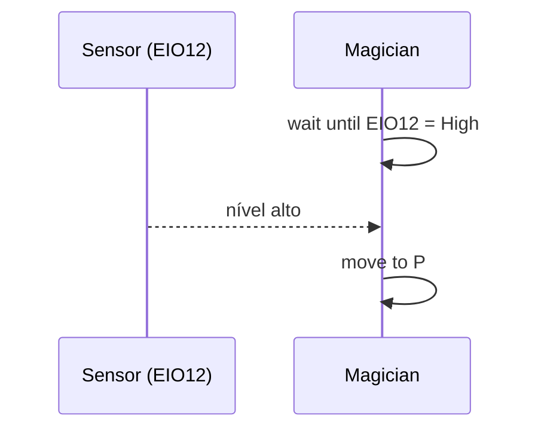

# 15. I/O multiplexado

!!! abstract "Objetivos do capítulo"

    - Configurar o I/O pelo Teaching and Playback Lab, pelo Blockly e pelo Python Lab.
    - Usar saída digital, entrada digital e PWM com exemplos práticos.

Os endereços de I/O do Magician são unificados (EIO1 a EIO20) e a maioria dos
pinos acumula funções. O mapa completo está no
[cap. 4](../fundamentos/conexao-interfaces.md#46-io-multiplexado-eio).

## 15.1 Onde configurar o I/O

| Ambiente | Como |
|---|---|
| Teaching and Playback Lab | Seção **I/O trigger settings** do painel de comandos. |
| DobotBlock Lab | Categoria **I/O**: `Set port … mode`, `Set PWM output port`, `Set digital output port`, `Get digital signal` e `Get analog signal`. |
| Python Lab | Comandos `set_multiplexing`, `set_pwm`, `set_do`, `get_di` e `get_adc`. |
| `pydobot` | Só saída digital (`set_eio`); para o resto, veja o [cap. 21](../casos/sensor-io.md). |

Os exemplos a seguir usam o **Teaching and Playback Lab**.

## 15.2 Saída digital: controlando a bomba de ar

A bomba de ar é controlada por duas EIOs da base:

| EIO | Tensão | Saída digital | PWM | Entrada | ADC | Papel na bomba |
|---|---|---|---|---|---|---|
| 11 | 3,3 V | ✓ | ✓ | – | – | Sucção (nível **alto**) ou exaustão (nível **baixo**) |
| 16 | 12 V | ✓ | – | – | – | Liga e desliga a bomba |

**Pré-requisitos:** bomba conectada ([cap. 11](teaching-playback.md#111-instalando-a-ventosa));
robô ligado e conectado.

1. Abra o Teaching and Playback Lab e escolha **Pen** como efetuador no painel
   de controle do braço. Assim, o lab não controla a bomba por conta própria.
2. Em **I/O trigger settings**, escolha o modo **LEVEL OUTPUT**, ajuste **EIO11** e
   **EIO16** para **High** e clique em **Add**. Dois comandos *trigger* aparecem.
3. Clique em **Running program**. A bomba funciona em **sucção**.
4. Mude o valor da EIO11 para **Low**.
5. Clique em **Running program**. A bomba funciona em **exaustão**.

## 15.3 Entrada digital: esperar por um sinal

Exemplo com a **EIO12** (GP1), que é somente entrada digital de 3,3 V.

**Pré-requisitos:** robô conectado; lista de pontos salva no Teaching and
Playback Lab.

1. Em **I/O trigger settings**, escolha o modo **LEVEL INPUT**, ajuste **EIO12 =
   High** e clique em **Add**. Um comando **wait until** aparece.
2. Mova o comando *wait until* para **antes** do comando de movimento.
3. Clique em **Running program**. O robô só se move quando a EIO12 for para
   nível alto.

## 15.4 Saída PWM

Exemplo com a **EIO11** (GP1), que suporta PWM.

**Pré-requisito:** robô conectado.

1. Em **I/O trigger settings**, escolha o modo **PWM**, a **EIO11**, o **período**
   (por exemplo, 5 ms) e o **ciclo de trabalho** (por exemplo, 15%). Clique em
   **Add**.
2. Mova o comando *trigger* para antes do comando de movimento.
3. Clique em **Running program**.

!!! tip "PWM e servos"

    Um período de 20 ms com ciclo de trabalho entre cerca de 5% e 10% é o
    padrão de controle de servomotores de hobby. Lembre do limite de **20 mA**
    da saída de 3,3 V: o pino gera só o **sinal**; a alimentação do servo deve
    vir de outra fonte.

---

*Fonte: Dobot Magician User Guide V2.3.14, seções 4.3 e 5.12.*
