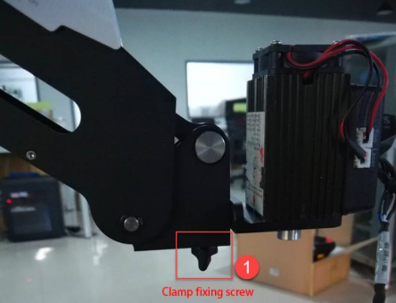
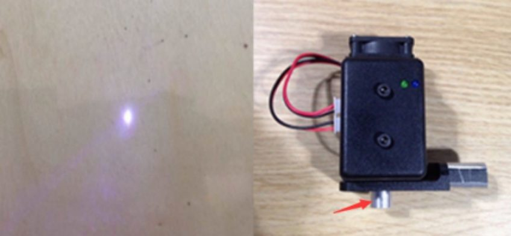

# 10. Gravação a laser

!!! abstract "Objetivos do capítulo"

    - Instalar o kit laser com segurança.
    - Gravar uma imagem com o Laser Engraving Lab.
    - Ajustar o foco do laser.

!!! danger "Perigo: laser"

    - Use **óculos de proteção para laser** durante todo o uso.
    - No ponto de foco, o calor é suficiente para **queimar** papel e madeira.
      Tenha um extintor por perto e não deixe material inflamável na bancada.
    - **Nunca** aponte o laser para pessoas ou roupas.
    - Supervisione o robô durante toda a execução e desligue ao terminar.

## 10.1 Instalando o kit laser

1. Fixe o laser na ponta do Magician com o **parafuso de fixação**.
2. Ligue o cabo de **energia** do laser ao conector **SW4** do antebraço e o
   cabo de **controle TTL** ao conector **GP5**.
3. Coloque uma folha de papel pardo sobre a superfície de trabalho, dentro do
   workspace.

<figure markdown="span">
  { width="440" }
  <figcaption>Figura 10.1: Laser preso pelo parafuso de fixação. Fonte: User Guide, fig. 5.52.</figcaption>
</figure>

## 10.2 Gravando

1. **Conectar:** na página inicial, abra o **Laser Engraving Lab**, escolha
   **Magician** e clique em **Connect**.
2. **Importar:** clique em **Open** e escolha a imagem.
3. **Posicionar:** arraste a imagem. Posição, tamanho, rotação, espelhamento,
   **escala de cinza** e **borda** ficam nas configurações. A imagem precisa
   ficar dentro da área anular; fora dela, fica com borda vermelha.
4. Clique em **Home** no painel de controle do braço.
5. **Ligar o laser:** no painel de controle, escolha **Laser** como efetuador e
   clique em **Open** depois de habilitar. O laser acende. Ajuste a faixa de
   potência se precisar.
6. **Ajustar o foco:** mantenha **Unlock** pressionado e suba ou desça o braço
   até o ponto de luz ficar **o menor e mais brilhante possível**. Clique em
   **Auto Z** para gravar a altura.

    !!! note "Não consigo focar"
        A distância focal pode estar longa demais. Gire levemente o parafuso na
        parte de baixo do laser para encurtá-la.

    <figure markdown="span">
      { width="480" }
      <figcaption>Figura 10.2: Ponto focado (à esquerda) e parafuso de ajuste de foco (à direita). Fonte: User Guide, fig. 5.58.</figcaption>
    </figure>

7. *(Opcional)* Clique em **Synchronize** para levar o laser ao ponto inicial.
8. Clique em **Running program**. O cursor mostra a posição do laser e o
   progresso aparece embaixo. Use **Pause** ou **Stop** quando precisar.
9. *(Opcional)* **Save** para salvar em *My Works*.

---

*Fonte: Dobot Magician User Guide V2.3.14, seção 5.6.*
