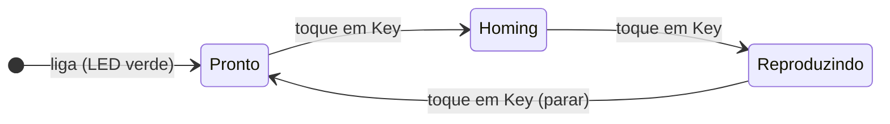
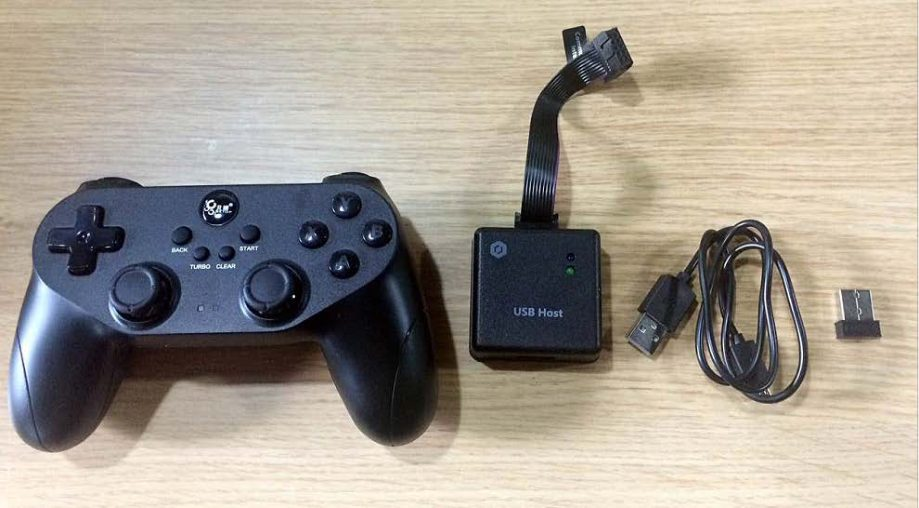

# 14. Modo offline e joystick

!!! abstract "Objetivos do capítulo"

    - Gravar uma sequência no robô e executá-la sem computador.
    - Controlar o Magician com o kit de joystick.

## 14.1 Modo offline

No modo offline, o Magician executa a lista de pontos gravada a partir do
DobotLab **sem manter a conexão USB**. É útil para demonstrações e para deixar
uma tarefa rodando sem PC.

**Pré-requisitos:** robô ligado e conectado ao DobotLab; pontos salvos no
Teaching and Playback Lab ([cap. 11](teaching-playback.md)).

1. Com os pontos salvos, clique em **Download**. Uma janela pergunta se o robô
   deve **voltar ao ponto de origem** antes de rodar offline.
2. Clique em **Yes**. Ao terminar, aparece "The script has been downloaded to
   Magician successfully".
3. Desconecte o Magician do DobotLab, ou retire o cabo USB.
4. Dê um **toque curto** na tecla **Key**, na traseira da base.
5. O robô vai à origem e executa os pontos. Para **parar**, toque em **Key** de
   novo.

!!! tip "Precisão"

    Levar o robô à origem antes de rodar offline melhora a precisão.

!!! note "Ligando com um programa já gravado"

    Se já houver pontos gravados, ligue o robô, espere cerca de **20 s** depois
    que o LED ficar verde e toque em **Key** para fazer o homing. Toque em
    **Key** de novo para começar a reprodução.

## 14.2 Kit de joystick

O kit (*stick controller kit*) tem um **controle**, um **módulo USB Host**, um
cabo USB para carregar o controle e um **receptor** sem fio.

<figure markdown="span">
  { width="520" }
  <figcaption>Figura 14.1: Kit de joystick: controle, módulo USB Host, cabo e receptor. Fonte: User Guide, fig. 5.137.</figcaption>
</figure>

!!! warning "Atenção"

    - **Não** conecte o Magician ao DobotLab enquanto usa o joystick.
    - **Desligue** o robô antes de conectar ou desconectar o módulo.

**Pré-requisito:** Magician ligado à fonte.

1. Conecte o receptor ao módulo USB Host.
2. Conecte o módulo à interface de **comunicação (UART)** da base com o cabo de
   10 pinos. No robô, a fenda do conector fica **para cima**; no módulo, fica
   **para baixo**.
3. Ligue o Magician. O LED azul do módulo acende; depois de quatro bipes curtos,
   acende o verde.
4. Ligue o controle. O LED vermelho central indica que o robô pode ser
   controlado.

| Botão | Função |
|---|---|
| Power | Liga o controle. Ele também desliga automaticamente. |
| LT / RT | Liga / desliga o motor periférico. |
| RB | Modo de coordenadas **cartesianas**. |
| LB | Modo de coordenadas de **juntas**. |
| X | Bomba de ar: exaustão (soltar). |
| Y | Bomba de ar: sucção (pegar). |
| B | Desliga a bomba de ar. |
| Analógico esquerdo, frente/trás | Cartesiano: eixo **X** ±. Juntas: **J1** ±. |
| Analógico esquerdo, esquerda/direita | Cartesiano: eixo **Y** ±. Juntas: **J2** ±. |
| Analógico direito, frente/trás | Cartesiano: eixo **Z** ±. Juntas: **J3** ±. |
| Analógico direito, esquerda/direita | Cartesiano: eixo **R** ±. Juntas: **J4** ±. |

---

*Fonte: Dobot Magician User Guide V2.3.14, seções 5.10 e 5.11.*
