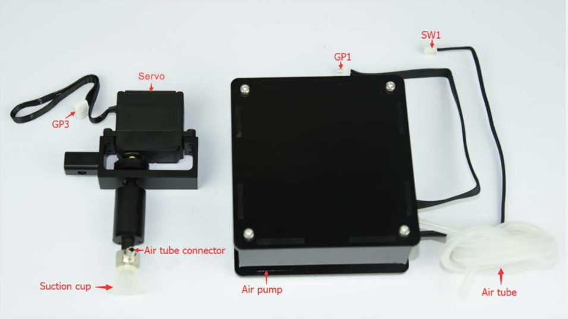
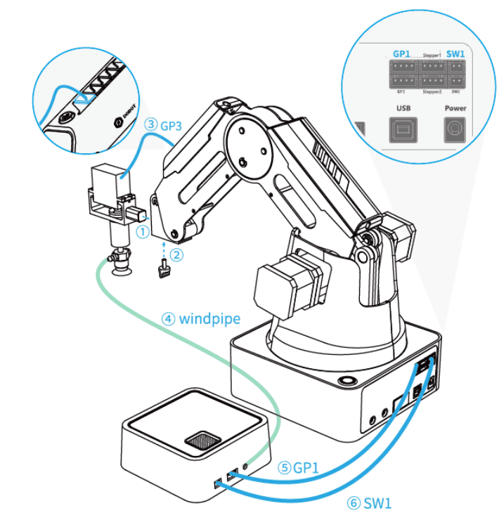
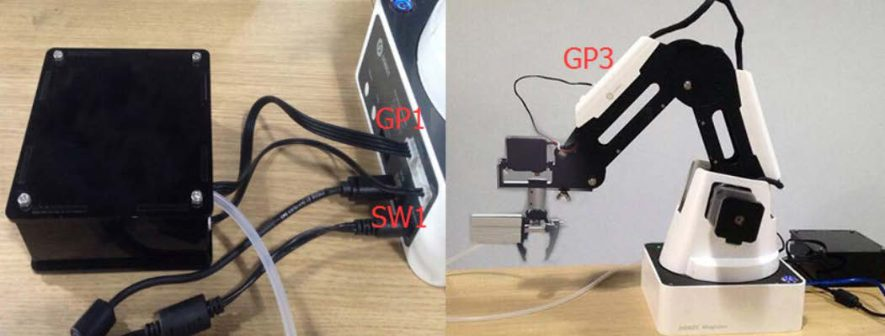
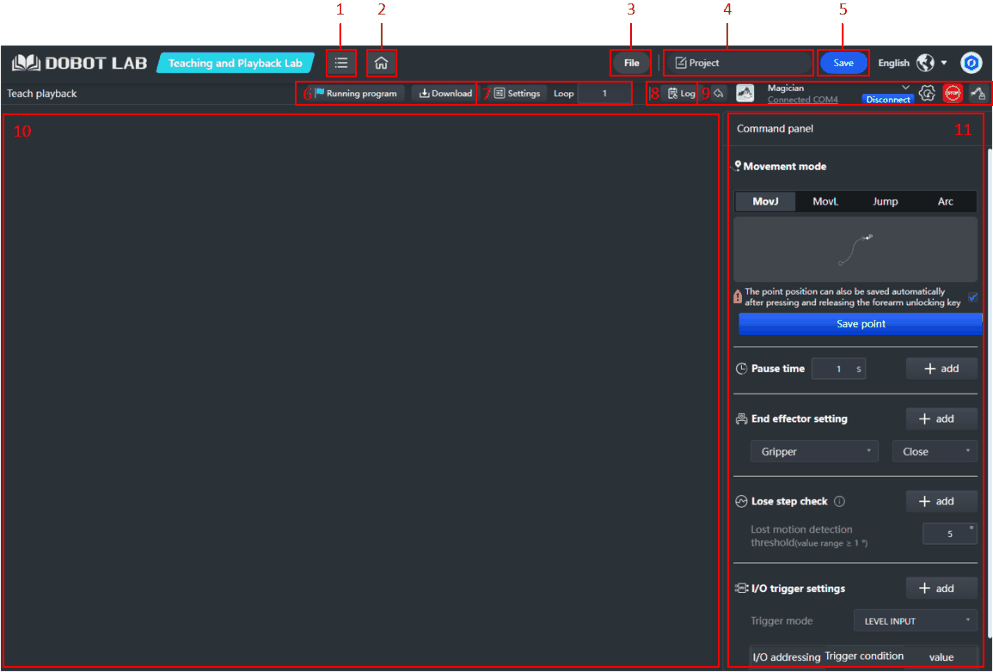
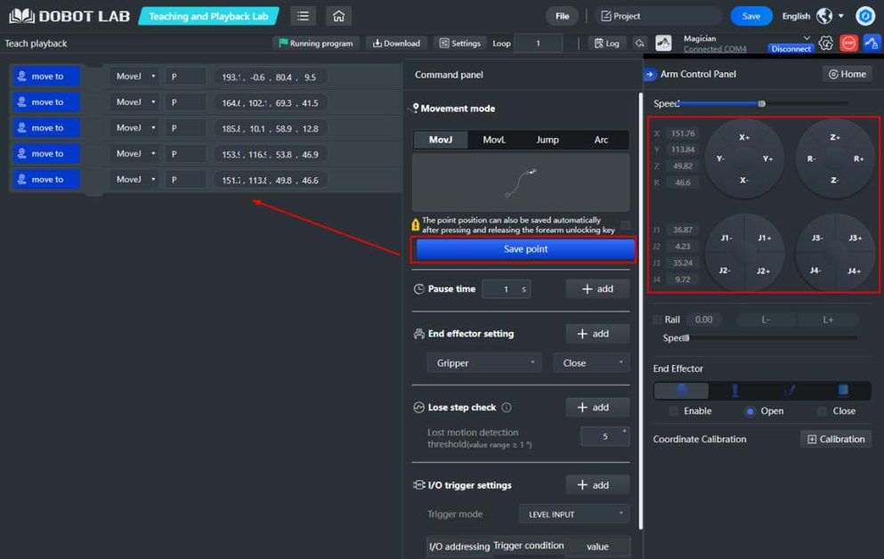

# 11. Teaching & Playback

!!! abstract "Objetivos do capítulo"

    - Instalar a ventosa e a garra pneumática.
    - Ensinar pontos ao robô por guiamento manual e por jog.
    - Montar uma sequência de comandos com modos de movimento, pausas,
      efetuador e gatilhos de I/O.

*Teaching & playback* é o jeito mais direto de programar o Magician: você
**mostra** os pontos (ensino) e o robô **repete** a sequência (reprodução). É o
equivalente, em escala educacional, ao **guiamento manual** da robótica
colaborativa ([cap. 1](../fundamentos/robotica-colaborativa.md#14-os-quatro-modos-de-operacao-colaborativa)).

## 11.1 Instalando a ventosa

A ventosa é o efetuador que vem com o Magician. Ela precisa da **bomba de ar**.

<figure markdown="span">
  { width="560" }
  <figcaption>Figura 11.1: Kit de ventosa: servo (GP3), ventosa, conector do tubo de ar e bomba de ar (GP1, SW1). Fonte: User Guide, fig. 5.61.</figcaption>
</figure>

<figure markdown="span">
  { width="420" }
  <figcaption>Figura 11.2: Conexões: ① e ② fixação, ③ servo em GP3, ④ tubo de ar, ⑤ sinal da bomba em GP1 e ⑥ alimentação da bomba em SW1. Fonte: User Guide, fig. 5.62.</figcaption>
</figure>

## 11.2 Instalando a garra

A garra também é pneumática e usa a mesma bomba para abrir e fechar.

1. Remova a ventosa: afrouxe o parafuso de fixação dela com uma chave Allen de
   1,5 mm.
2. Instale a garra no servo com uma chave Allen de 2,5 mm.
3. Conecte a garra e a bomba como na ventosa (servo em **GP3**; bomba em **GP1**
   e **SW1**).

<figure markdown="span">
  { width="560" }
  <figcaption>Figura 11.3: Garra instalada e bomba conectada. Fonte: User Guide, fig. 5.66.</figcaption>
</figure>

## 11.3 O Teaching and Playback Lab

<figure markdown="span">
  { width="680" }
  <figcaption>Figura 11.4: Interface do Teaching and Playback Lab. Fonte: User Guide, fig. 5.67.</figcaption>
</figure>

| Área | Função |
|---|---|
| File / Save | Novo, abrir, salvar como, enviar do computador; salvar em *My Works*. |
| Running program / Download | Executa a lista de comandos ou grava no robô (modo offline). |
| Settings / Loop | Velocidade e aceleração; número de repetições (1 a 999999). |
| Log | Alarmes. |
| Device control | Conectar, **parada de emergência** (botão Stop) e painel do braço. |
| Control panel | Modo de movimento, pausa, efetuador, detecção de perda de passo, gatilho de I/O e salvar ponto. |
| Command list | Lista de comandos. Clique com o botão direito para copiar, colar ou excluir. |

## 11.4 Ensinando uma sequência

1. Na página inicial, abra o **Teaching and Playback Lab**.
2. Conecte o **Magician**.
3. Configure os comandos no **Control panel**:

    **a) Modo de movimento**

    | Modo | Comportamento |
    |---|---|
    | MovJ | Ponto a ponto no espaço cartesiano (trajetória livre). |
    | MovL | Linha reta no espaço cartesiano. |
    | Jump | Movimento em "porta" até o alvo. Clique em **Jump parameter setting** para definir a altura da porta (padrão 20 mm) e o limite de elevação, *zlimit* (padrão 100 mm). |
    | Arc | Arco interpolado. Defina início, ponto intermediário (*cirPoint*) e fim (*toPoint*). Ao salvar o início, escolha também o modo de movimento até ele. |

    **b) Salvar pontos**

    - **Método 1, guiamento manual:** mantenha **Unlock** no antebraço
      pressionado, mova o braço com a mão e **solte**. O ponto é salvo
      automaticamente.
    - **Método 2, jog:** abra o painel de controle do braço, ajuste a posição
      pelos botões de eixo e clique em **Save point**.

    <figure markdown="span">
      { width="680" }
      <figcaption>Figura 11.5: Pontos salvos aparecem como comandos "move to". Fonte: User Guide, fig. 5.70.</figcaption>
    </figure>

    !!! warning "Regras para pontos de arco"
        Dois pontos não podem coincidir, os três pontos não podem estar
        alinhados e o arco não pode sair do workspace.

    **c) Pausa:** defina o tempo de espera após um comando e clique em **add**.

    **d) Efetuador:** escolha a garra (Close, Open ou Stop) ou a ventosa (On ou
    Off) e clique em **add**.

    **e) Detecção de perda de passo:** detecta se o braço perdeu passo durante
    a execução. Nesse caso, o robô **para** e o LED fica **vermelho**. Para
    voltar a operar, limpe o alarme e faça o homing. Defina o limiar e clique
    em **add**.

    **f) Gatilho de I/O:** dispara um comando a partir de uma condição de I/O
    ([cap. 15](io.md)).

    **g) Loop:** número de vezes que a lista será executada.

4. Clique em **Running program**.
5. *(Opcional)* **Save** para salvar em *My Works*.
6. *(Opcional)* **Download** para gravar a lista no robô e rodar **offline**
   ([cap. 14](offline-stick.md)). Escolha se o robô deve voltar ao ponto
   de origem antes de rodar offline.

## 11.5 Exercício

Ensine uma sequência de **pick-and-place** com a ventosa:

1. ponto de aproximação acima da peça (MovJ);
2. ponto da peça (Jump), ventosa **On** e pausa de 0,5 s;
3. ponto de destino (Jump), ventosa **Off** e pausa de 0,5 s;
4. volta ao ponto de aproximação.

Execute com velocidade baixa, depois com loop = 3. No [cap. 19](../casos/pick-and-place.md)
fazemos o mesmo em Python.

---

*Fonte: Dobot Magician User Guide V2.3.14, seção 5.7.*
