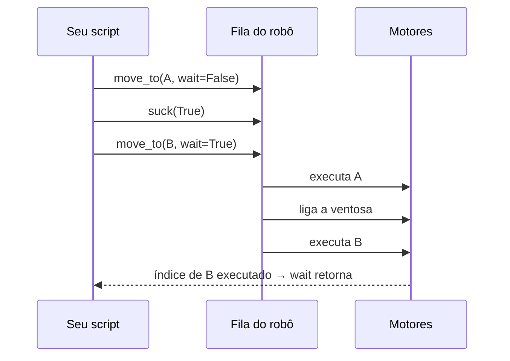

# 17. Python com `pydobot`

!!! abstract "Objetivos do capítulo"

    - Instalar o `pydobot` e conectar ao Magician pela porta serial.
    - Conhecer toda a API pública da biblioteca e o comportamento de cada função.
    - Estender a biblioteca para JUMP, MOVJ, homing e limpeza de alarmes.
    - Diagnosticar os problemas mais comuns.

## 17.1 O que é o `pydobot`

O [`pydobot`](https://pypi.org/project/pydobot/) é uma biblioteca Python de
código aberto ([GitHub](https://github.com/luismesas/pydobot)) que fala
**direto com o Magician pela porta serial**, usando o protocolo de comunicação
da Dobot. Ela **não precisa** do DobotLab nem do DobotLink.

| | |
|---|---|
| Versão de referência | **1.3.2** (última no PyPI) |
| Dependência | `pyserial==3.4` (versão fixa) |
| Conexão | Serial USB a 115200 baud |
| Licença / manutenção | Projeto comunitário, sem suporte oficial da Dobot |

!!! info "Como este capítulo foi escrito"

    Todas as assinaturas e comportamentos descritos aqui foram conferidos no
    **código-fonte do `pydobot` 1.3.2** e no **Dobot Magician Communication
    Protocol V1.1.5**. Os exemplos não foram executados no robô do laboratório
    durante a redação: rode-os primeiro com velocidade baixa e Z alto.

## 17.2 Pré-requisitos

1. **Driver USB-serial.** O Magician usa um conversor **Silicon Labs CP210x**: o
   DobotLab mostra a porta como `COM4 (Silicon Labs CP2...)`. No Windows e no
   macOS, instale o driver CP210x se a porta não aparecer. No Linux, o driver
   `cp210x` já vem no kernel.
2. **Porta livre.** Feche o **DobotLab** e o **DobotLink**. Eles ocupam a porta
   serial, e só um programa por vez pode abri-la.
3. **Permissão (Linux).** Adicione seu usuário ao grupo `dialout` e faça logout
   e login de novo:

    ```sh
    sudo usermod -aG dialout $USER
    ```

4. **Robô pronto.** LED **verde**. De preferência, faça o homing pelo DobotLab ou
   segure a tecla **Key** por 2 s antes de rodar scripts.

## 17.3 Instalação

=== "uv"

    ``` sh
    uv init meu-projeto-dobot
    cd meu-projeto-dobot
    uv add pydobot
    ```

=== "pip + venv"

    ``` sh
    python -m venv .venv
    source .venv/bin/activate   # Windows: .venv\Scripts\activate
    pip install pydobot
    ```

!!! warning "`pyserial` fixado em 3.4"

    O `pydobot` exige exatamente `pyserial==3.4`. Use um **ambiente virtual
    separado** para não entrar em conflito com outros projetos que precisem de
    uma versão mais nova do `pyserial`.

## 17.4 Encontrando a porta

```python title="listar_portas.py"
from serial.tools import list_ports

for p in list_ports.comports():
    print(f"{p.device:30} {p.description}")
```

| Sistema | Nome típico da porta |
|---|---|
| Windows | `COM3`, `COM4`, … |
| macOS | `/dev/cu.usbserial-XXXX` ou `/dev/cu.SLAB_USBtoUART` |
| Linux | `/dev/ttyUSB0` |

Para escolher a porta automaticamente pelo fabricante do conversor:

```python
from serial.tools import list_ports


def porta_do_magician():
    for p in list_ports.comports():
        texto = f"{p.description} {p.manufacturer or ''}".lower()
        if "cp210" in texto or "silicon labs" in texto:
            return p.device
    raise RuntimeError("Magician não encontrado. Confira o cabo, o driver e se o DobotLab está fechado.")
```

## 17.5 Primeiro programa

```python title="primeiro_programa.py" linenums="1"
from pydobot import Dobot

PORTA = "/dev/ttyUSB0"  # ajuste para a sua porta

robo = Dobot(port=PORTA, verbose=False)  # (1)!
try:
    x, y, z, r, j1, j2, j3, j4 = robo.pose()  # (2)!
    print(f"Pose atual: x={x:.1f} y={y:.1f} z={z:.1f} r={r:.1f}")

    robo.speed(velocity=30, acceleration=30)  # (3)!

    robo.move_to(x, y, z + 30, r, wait=True)  # (4)!
    robo.move_to(x + 20, y, z + 30, r, wait=True)
    robo.move_to(x, y, z, r, wait=True)  # volta à pose inicial
finally:
    robo.close()  # (5)!
```

1. Abre a porta a 115200 baud, **inicia** e **limpa** a fila de comandos do robô
   e aplica parâmetros padrão de velocidade (ver [17.7](#177-o-que-o-construtor-faz)).
2. `pose()` retorna uma tupla de 8 valores: posição cartesiana (mm), rotação R
   (°) e ângulos das juntas J1 a J4 (°).
3. Reduz a velocidade. Faça isso **sempre** no começo dos testes.
4. Sobe 30 mm primeiro, para não arrastar a ferramenta na mesa. `wait=True`
   bloqueia até o robô **terminar** o movimento.
5. `close()` fecha a porta serial. O `try/finally` garante que ela seja fechada
   mesmo se houver erro ou `Ctrl+C`.

## 17.6 Referência da API

| Método | Descrição | Fila? |
|---|---|---|
| `Dobot(port, verbose=False)` | Conecta, inicia e limpa a fila e aplica parâmetros padrão. `verbose=True` imprime os pacotes trocados. | – |
| `pose()` | Retorna `(x, y, z, r, j1, j2, j3, j4)`. | Imediato |
| `move_to(x, y, z, r, wait=False)` | Move em **linha reta** (modo `MOVL_XYZ`) até a pose. Com `wait=True`, bloqueia até o fim do movimento. | Sim |
| `speed(velocity=100., acceleration=100.)` | Ajusta a velocidade e a aceleração de PTP (razão comum e parâmetros cartesianos). | Sim |
| `suck(enable)` | Ventosa: `True` liga a sucção; `False` desliga. | Sim |
| `grip(enable)` | Garra: `True` fecha; `False` abre. | Sim |
| `wait(ms)` | Insere uma **pausa na fila** do robô, em milissegundos. | Sim |
| `set_eio(addr, val)` | Ajusta a **saída digital** da EIO `addr` (1 a 20) para `val` (0 ou 1). | **Imediato** |
| `get_eio(addr)` | Lê o estado da **saída digital** da EIO `addr`. Retorna a mensagem bruta. | Imediato |
| `close()` | Fecha a porta serial. | – |
| `go(x, y, z, r=0.)` | **Obsoleto.** Use `move_to`. | – |

### A fila de comandos

O controlador do Magician tem uma **fila**. Comandos "em fila" são executados
em ordem, um após o outro. Comandos "imediatos" são executados assim que
chegam, **furando a fila**.



!!! warning "Três armadilhas da fila"

    1. **O script pode terminar antes do robô.** Com `wait=False`, os comandos
       são só **enviados**. Termine sempre com um movimento `wait=True`.
    2. **`set_eio` é imediato.** Ele não espera os movimentos anteriores. Para
       acionar uma saída **depois** de um movimento, use `wait=True` no
       movimento anterior.
    3. **`wait(ms)` é uma pausa do robô, não do Python.** Para pausar o script,
       use `time.sleep()`.

### Latência

Cada comando do `pydobot` espera cerca de **0,2 s** (100 ms para enviar e
100 ms para ler a resposta). Uma trajetória com 100 pontos leva ao menos 20 s
só de comunicação. Leve isso em conta em desenhos com muitos pontos
([cap. 20](../casos/desenho-trajetoria.md)).

### `get_eio` não lê entradas

!!! danger "Atenção ao ler sensores"

    O `get_eio` usa o comando de ID **131** do protocolo (*Get IODO*), que
    retorna o **nível da saída digital**, e não o de uma **entrada**. Para ler
    um sensor, é preciso configurar a multiplexação (ID 130) e usar *Get IODI*
    (ID 133) ou *Get IOADC* (ID 134). O [cap. 21](../casos/sensor-io.md) traz
    funções prontas para isso.

## 17.7 O que o construtor faz

Ao criar `Dobot(port)`, a biblioteca:

1. abre a serial (115200 baud, 8N1);
2. **inicia** a execução da fila e **limpa** comandos pendentes;
3. define parâmetros padrão de PTP:
    - juntas: velocidade e aceleração 200;
    - cartesiano: velocidade e aceleração 200;
    - JUMP: altura 10 mm e limite de Z em 200 mm;
    - razão comum: velocidade 100% e aceleração 100%;
4. lê a pose atual.

Ou seja, um script novo **sempre começa em 100% de velocidade**. Chame
`speed()` logo depois de conectar.

## 17.8 Modos PTP

O protocolo da Dobot define 10 modos de movimento ponto a ponto. O `pydobot`
expõe a enumeração em `pydobot.enums.PTPMode`, mas o `move_to` público usa
**apenas** o `MOVL_XYZ`.

| Valor | `PTPMode` | Movimento | Coordenadas do alvo |
|---|---|---|---|
| 0 | `JUMP_XYZ` | JUMP | Cartesianas |
| 1 | `MOVJ_XYZ` | Juntas | Cartesianas |
| 2 | `MOVL_XYZ` | Linear | Cartesianas |
| 3 | `JUMP_ANGLE` | JUMP | Ângulos de junta |
| 4 | `MOVJ_ANGLE` | Juntas | Ângulos de junta |
| 5 | `MOVL_ANGLE` | Linear | Ângulos de junta |
| 6 | `MOVJ_INC` | Juntas | Incremento de ângulo |
| 7 | `MOVL_INC` | Linear | Incremento cartesiano |
| 8 | `MOVJ_XYZ_INC` | Juntas | Incremento cartesiano |
| 9 | `JUMP_MOVL_XYZ` | JUMP + linear | Cartesianas |

## 17.9 Estendendo a biblioteca

A classe abaixo herda de `Dobot` e adiciona o que falta para o uso no dia a dia:
JUMP, MOVJ, parâmetros de JUMP, homing, limpeza de alarmes e um desligamento
completo da bomba.

```python title="magician.py" linenums="1"
"""Extensão do pydobot 1.3.2 para o Dobot Magician.

Usa métodos internos (prefixo _) do pydobot e IDs do Dobot Magician
Communication Protocol V1.1.5. Revise ao atualizar a biblioteca.
"""
import struct

from pydobot import Dobot
from pydobot.enums import PTPMode
from pydobot.message import Message

QUEUED = 0x03     # rw=1, isQueued=1
IMMEDIATE = 0x01  # rw=1, isQueued=0


class Magician(Dobot):

    def jump_to(self, x, y, z, r=0.0, wait=True):
        """Sobe, desloca e desce até (x, y, z) — ideal para pegar e soltar."""
        self._set_ptp_cmd(x, y, z, r, mode=PTPMode.JUMP_XYZ, wait=wait)

    def movj_to(self, x, y, z, r=0.0, wait=True):
        """Movimento de juntas (mais rápido; trajetória não é reta)."""
        self._set_ptp_cmd(x, y, z, r, mode=PTPMode.MOVJ_XYZ, wait=wait)

    def jump_params(self, height=20.0, z_limit=100.0):
        """Altura da 'porta' do JUMP e limite máximo de Z, em mm."""
        self._set_ptp_jump_params(height, z_limit)

    def home(self):
        """Executa o homing (ID 31) e espera terminar."""
        msg = Message()
        msg.id = 31
        msg.ctrl = QUEUED
        msg.params = bytearray(struct.pack("I", 0))  # campo reservado
        return self._send_command(msg, wait=True)

    def clear_alarms(self):
        """Limpa os alarmes ativos (ID 21)."""
        msg = Message()
        msg.id = 21
        msg.ctrl = IMMEDIATE
        return self._send_command(msg)

    def pump_off(self):
        """Desabilita o controle da ventosa (isCtrlEnabled=0, issucked=0)."""
        msg = Message()
        msg.id = 62
        msg.ctrl = QUEUED
        msg.params = bytearray([0x00, 0x00])
        return self._send_command(msg)
```

!!! warning "Métodos internos"

    `_set_ptp_cmd`, `_set_ptp_jump_params` e `_send_command` não fazem parte da
    API pública e podem mudar numa versão futura. Fixe a versão no seu projeto
    (`pydobot==1.3.2`) e teste a extensão com velocidade baixa antes de usar.

!!! note "Por que `pump_off`?"

    O `suck(False)` envia `isCtrlEnabled=1` e `issucked=0`: o controle da
    ventosa continua **habilitado**, só sem sucção. Se a bomba continuar
    funcionando depois de soltar a peça, use `pump_off()`, que desabilita o
    controle.

Exemplo de uso:

```python
from magician import Magician

robo = Magician(port="/dev/ttyUSB0")
try:
    robo.speed(30, 30)
    robo.jump_params(height=30, z_limit=100)
    robo.home()
    robo.jump_to(200, 0, 20)
finally:
    robo.close()
```

## 17.10 Solução de problemas

| Sintoma | Causa provável | Solução |
|---|---|---|
| `SerialException: could not open port` / `Resource busy` / `Access is denied` | Porta ocupada pelo DobotLab, pelo DobotLink ou por outro script | Feche esses programas e o kernel do Jupyter que esteja com o robô aberto. |
| `Permission denied: '/dev/ttyUSB0'` | Linux sem permissão | `sudo usermod -aG dialout $USER` e novo login. |
| Nenhuma porta aparece | Cabo, driver CP210x ou robô desligado | Troque o cabo (alguns só carregam, sem dados), instale o driver e ligue o robô. |
| `TypeError` ou `struct.error` logo após conectar | Resposta vazia: robô ainda inicializando ou porta errada | Espere o LED verde, confira a porta e tente de novo. |
| O script termina e o robô continua se movendo | Comandos enfileirados com `wait=False` | Termine com `wait=True`. |
| O robô não se move e o LED está vermelho | Posição limite ou alarme (perda de passo) | Mova o braço para o workspace com **Unlock**, limpe o alarme (`clear_alarms()` ou DobotLab) e faça o homing. |
| A pose lida não bate com a realidade | Perda de passo ou impacto | Homing ([cap. 13](../operacao/calibracao.md#133-homing)). |
| O robô "pula" de velocidade | O construtor redefine a velocidade para 100% | Chame `speed()` logo após conectar. |

---

*Fontes: código-fonte do `pydobot` 1.3.2 e Dobot Magician Communication Protocol
V1.1.5 (IDs 10, 21, 31, 62, 63, 82, 83, 84, 130, 131, 133 e 134).*
