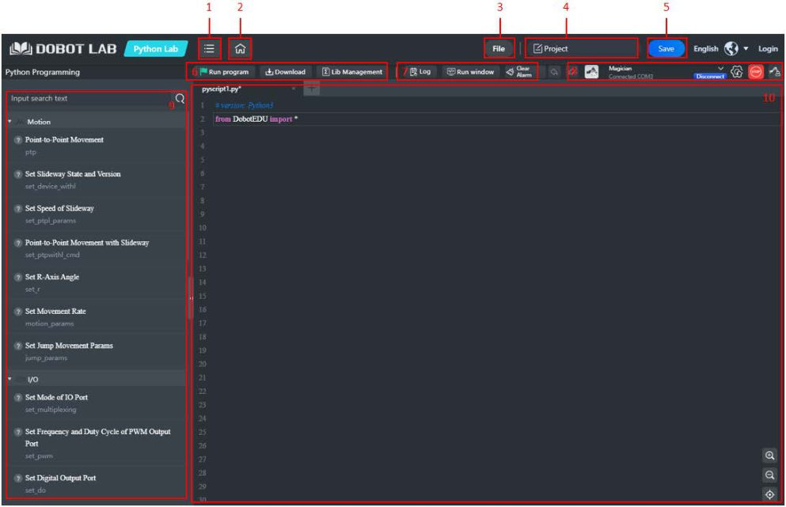

# 16. Python no DobotLab (Python Lab)

!!! abstract "Objetivos do capítulo"

    - Usar o Python Lab do DobotLab.
    - Conhecer os principais comandos da API `DobotEDU`.
    - Entender quando usar o Python Lab e quando usar o `pydobot`.

O **Python Lab** permite controlar o Magician por script, com APIs para
velocidade e aceleração, modos de movimento, I/O e outros recursos. A referência
completa está no documento *Dobot Magician API Description*, na
[Download Center da Dobot](https://en.dobot.cn/service/download-center?keyword=&products%5B%5D=316).

## 16.1 A interface

<figure markdown="span">
  { width="680" }
  <figcaption>Figura 16.1: Interface do Python Lab. Fonte: User Guide, fig. 5.15.</figcaption>
</figure>

| Área | Função |
|---|---|
| File | Novo, abrir, salvar como etc. **Import/Export** usa arquivos `.py`; **Upload from Local/Save to Local** usa `.json`. |
| Save | Salva o projeto em *My Works*. |
| Running program / Stop | Executa o código. Durante a execução, aparece o botão **Stop**. |
| Download | Grava o programa no robô. Só funciona com **conexão por cabo**. |
| Lib Management | Instala bibliotecas Python de extensão. |
| Log / Run window | Alarmes (com **Clear Alarm**) e saída do programa. |
| Device control | Conexão, **parada de emergência** e painel do braço. |
| Command list | Comandos disponíveis. Um clique duplo insere o código. |
| Code area | Editor de Python. |

## 16.2 Rodando um programa

1. Na página inicial, abra o **Python Lab**.
2. Conecte o **Magician** pelo painel de conexão.
3. Escreva o script, ou dê um clique duplo nos comandos da lista e ajuste os
   parâmetros.
4. Clique em **Running program**.
5. *(Opcional)* **Save** para salvar em *My Works*.
6. *(Opcional)* **Download** para gravar no robô.

## 16.3 Comandos da API

Os scripts começam com `from DobotEDU import *`, que disponibiliza o objeto
`magician`.

| Categoria | Comando | Descrição na lista |
|---|---|---|
| Movimento | `magician.ptp(mode, x, y, z, r)` | Point-to-Point Movement |
| | `magician.set_r(...)` | Set R-Axis Angle |
| | `magician.motion_params(...)` | Set Movement Rate |
| | `magician.jump_params = zlimit, height` | Set Jump Movement Params |
| Trilho | `magician.set_device_withl(...)` | Set Slideway State and Version |
| | `magician.set_ptpl_params(vel, accel)` | Set Speed of Slideway |
| | `magician.set_ptpwithl_cmd(...)` | Point-to-Point Movement with Slideway |
| I/O | `magician.set_multiplexing(...)` | Set Mode of IO Port |
| | `magician.set_pwm(...)` | Set Frequency and Duty Cycle of PWM Output Port |
| | `magician.set_do(...)` | Set Digital Output Port |
| | `magician.get_di(...)` | Get Digital Signal |
| | `magician.get_adc(...)` | Get Analog Signal |
| Efetuador | `magician.set_endeffector_suctioncup(...)` | Set End Suction Cup |
| | `magician.set_endeffector_gripper(enable, on)` | Garra |
| Status | `magician.get_pose()`, `magician.get_posel()` | Pose do braço e do trilho |
| Outros | `magician.wait(second)`, `magician.set_home()` | Espera e homing |

!!! note "Assinaturas completas"

    Os nomes acima foram tirados da lista de comandos e do exemplo do manual.
    Para todos os parâmetros, consulte o *Dobot Magician API Description* ou dê
    um clique duplo no comando dentro do Python Lab, que insere um exemplo.

## 16.4 Exemplo do manual, comentado

Este é o programa da figura 5.18 do manual. Ele lê a pose atual e faz sete
movimentos ponto a ponto, deslocando X, Y, Z e R em 10 a cada passo e
acionando a garra nos passos 3 e 4. A única mudança em relação ao original é a
variável `sum`, renomeada para `num` para não esconder a função nativa `sum()`
do Python.

```python title="exemplo_manual.py" linenums="1"
from DobotEDU import *

index = 0
num = 7

site = magician.get_pose()             # (1)!
j = site["jointAngle"]
j1 = j[0]; j2 = j[1]; j3 = j[2]; j4 = j[3]
x = site["x"]; y = site["y"]; z = site["z"]; r = site["r"]

magician.set_ptpl_params(vel=50, accel=50)  # (2)!
magician.jump_params = 200, 20              # (3)!

while index < num:
    print(magician.get_pose())
    print(magician.get_posel())
    x += 10
    y += 10
    z += 10
    r += 10
    if index == 3:
        magician.set_ptpl_params(vel=10, accel=50)
        magician.set_endeffector_gripper(enable=True, on=True)   # (4)!
    elif index == 4:
        magician.jump_params = 200, 70
        magician.set_endeffector_gripper(enable=False, on=True)
    magician.ptp(0, x, y, z, r)        # (5)!
    index += 1

    magician.wait(second=2)

magician.set_home()                    # (6)!
```

1. `get_pose()` retorna um dicionário com `x`, `y`, `z`, `r` e `jointAngle`
   (lista com J1 a J4).
2. Na lista de comandos, `set_ptpl_params` aparece como *Set Speed of Slideway*:
   velocidade e aceleração em PTP com o **trilho**.
3. Parâmetros do JUMP: `zlimit` (limite de elevação) e `height` (altura da
   "porta"), em mm.
4. `enable` habilita o controle do efetuador; `on` define o estado da garra.
5. O primeiro argumento é o **modo PTP**. No protocolo de comunicação da Dobot,
   `0` é **JUMP** em coordenadas cartesianas ([cap. 17](pydobot.md#178-modos-ptp)).
   Confirme a numeração na *API Description*.
6. Executa o homing no fim. Lembre de deixar o workspace livre.

!!! danger "Cuidado ao rodar este exemplo"

    O exemplo **soma 10 mm a X, Y e Z** em cada volta, sem verificar o
    workspace. Dependendo da pose inicial, o robô pode atingir a posição limite.
    Comece com o braço bem dentro do workspace e com velocidade baixa.

## 16.5 Python Lab ou `pydobot`?

| | Python Lab (DobotLab) | `pydobot` |
|---|---|---|
| Onde roda | No navegador, via DobotLink | No seu Python, ligado direto na porta serial |
| Instalação | Nenhuma além do DobotLink | `pip`/`uv` |
| API | Completa (I/O, trilho, laser, sensores) | Mínima: movimento, ventosa, garra, velocidade, saída digital |
| Integração com outras bibliotecas | Limitada (Lib Management) | Total: OpenCV, NumPy, ROS, Jupyter etc. |
| Versionamento com git | Exportar `.py` | Natural |
| Download para o robô (offline) | Sim | Não |

**Regra prática:** para explorar e ensinar, use o Python Lab. Para integrar o
robô a um projeto maior (visão computacional, sensores, outras máquinas), use o
[`pydobot`](pydobot.md).

---

*Fonte: Dobot Magician User Guide V2.3.14, seção 5.4.*
