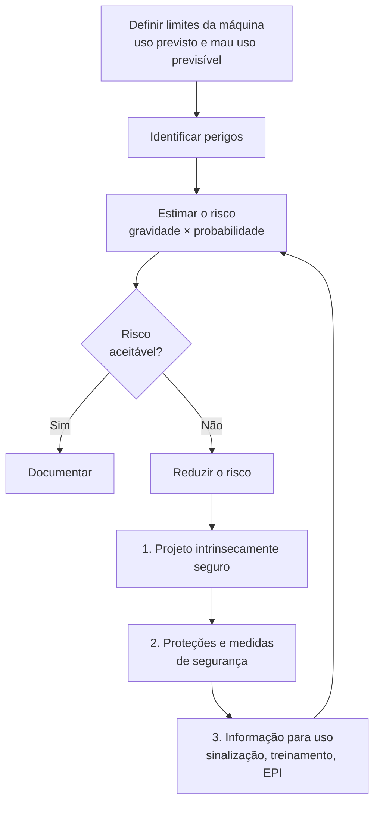

# 5. Normas e conceitos de segurança

!!! abstract "Objetivos do capítulo"

    - Conhecer as normas que regem a segurança de robôs e de aplicações colaborativas.
    - Entender o processo de avaliação e redução de risco.
    - Saber o que **não** se pode afirmar sobre a segurança do Magician.

## 5.1 Mapa das normas

| Norma | Escopo |
|---|---|
| **ISO 12100** | Princípios gerais de projeto de máquinas: **avaliação e redução de risco**. É a base metodológica das demais. |
| **ISO 10218-1** | Requisitos de segurança para o **robô industrial** (o fabricante do robô). |
| **ISO 10218-2** | Requisitos para **sistemas, aplicações e células** robóticas (o integrador). |
| **ISO/TS 15066** (2016) | Especificação técnica sobre **operação colaborativa**, com orientações sobre limitação de potência e força. |
| **ISO 13849-1** | Segurança funcional de partes de sistemas de comando relacionadas à segurança (níveis de desempenho, PL). |
| **NR-12** (Brasil) | Norma Regulamentadora do Ministério do Trabalho sobre segurança no trabalho em **máquinas e equipamentos**. É obrigatória no ambiente de trabalho brasileiro. |

!!! info "Revisão de 2025"

    A ISO 10218-1 e a ISO 10218-2 foram revisadas em **2025**, na primeira grande
    atualização desde 2011. O conteúdo da ISO/TS 15066 sobre aplicações
    colaborativas foi **incorporado** à série ISO 10218. Os requisitos de
    segurança funcional ficaram mais explícitos e foram incluídos temas como
    cibersegurança e ferramentas de efetuador.[^iso2025] Ao consultar material
    antigo, lembre que referências à "ISO/TS 15066" hoje apontam para a ISO 10218
    revisada.

## 5.2 Avaliação e redução de risco

Toda aplicação robótica, colaborativa ou não, parte de uma **avaliação de
risco** no modelo da ISO 12100:

A ordem das medidas importa: primeiro **eliminar** o perigo no projeto,
depois **proteger** e, só por último, **informar**. Um aviso no manual não
substitui uma proteção física quando ela é possível.

### Perigos típicos em aplicações robóticas

| Perigo | Exemplo no Magician |
|---|---|
| Mecânico: esmagamento, aprisionamento | Dedo entre o antebraço e o braço traseiro; recolhimento automático ao desligar. |
| Mecânico: impacto | Movimento rápido em MOVJ atingindo a mão. |
| Térmico | Hot end da impressão 3D a até **250 °C**. |
| Radiação óptica | **Laser** de gravação: risco para os olhos e a pele, além de incêndio. |
| Elétrico | Ligar periféricos com o robô energizado; ultrapassar os limites de corrente das EIOs. |
| Ferramenta | Objeto pontiagudo ou quente preso na garra ou na ventosa. |
| Software | Coordenada errada, laço infinito, velocidade alta por engano. |

## 5.3 Os quatro modos colaborativos, de novo

No [capítulo 1](../fundamentos/robotica-colaborativa.md) vimos os modos de
operação colaborativa. Do ponto de vista de segurança, cada modo exige
**funções de segurança** implementadas com o nível de confiabilidade adequado:

| Modo | Função de segurança necessária |
|---|---|
| Parada monitorada de segurança | Detecção de presença + parada monitorada com garantia. |
| Guiamento manual | Dispositivo de guiamento com habilitação e parada de emergência; velocidade limitada. |
| Velocidade e separação (SSM) | Sensores de distância com segurança funcional; cálculo da distância de proteção. |
| Potência e força (PFL) | Limitação de força e torque com segurança funcional; limites biomecânicos por região do corpo. |

## 5.4 E o Magician?

!!! warning "O que não se pode afirmar"

    - O Magician **não é** certificado pela ISO 10218 nem por qualquer norma de
      robô colaborativo.
    - O Magician **não tem** botão de parada de emergência certificado nem
      funções de segurança com nível de desempenho (PL) declarado.
    - O manual do fabricante proíbe o comissionamento como "máquina incompleta"
      até que ela seja integrada numa máquina conforme a Diretiva de Máquinas
      europeia (2006/42/CE).

O que **se pode** fazer com ele no laboratório:

- praticar **avaliação de risco** de uma aplicação real, em pequena escala;
- exercitar **procedimentos** de operação segura ([cap. 6](procedimentos.md));
- programar **defensivamente**: limites de workspace, velocidade baixa,
  confirmação antes de mover ([cap. 18](../programacao/boas-praticas.md));
- estudar **conceitualmente** os modos colaborativos, por exemplo simulando SSM
  com um sensor infravermelho que pausa o programa ([cap. 21](../casos/sensor-io.md)).

!!! example "Atividade: avaliação de risco de uma aplicação"

    Escolha uma aplicação do Magician (pick-and-place, laser ou impressão 3D) e
    preencha:

    | Perigo | Situação | Gravidade | Probabilidade | Medida de redução | Risco residual |
    |---|---|---|---|---|---|
    | … | … | … | … | … | … |

    Discuta com o grupo se as medidas seguem a ordem projeto → proteção →
    informação.

[^iso2025]: ISO 10218-1:2025 e ISO 10218-2:2025, *Robotics — Safety requirements*.
    Resumo da revisão: [Control Design, "ISO 10218 update makes functional-safety
    requirements more explicit"](https://www.controldesign.com/industry-news/news/55268769/iso-10218-update-makes-functional-safety-requirements-more-explicit).

---

*Fontes: ISO 12100, série ISO 10218, ISO/TS 15066, NR-12 e Dobot Magician User
Guide V2.3.14, seção 1.1.*
