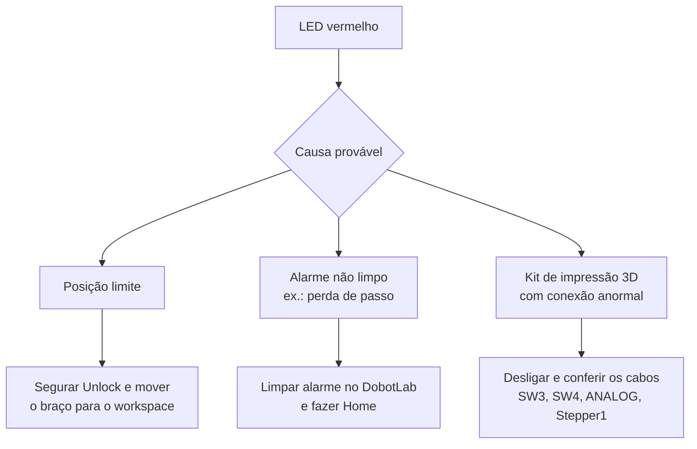

# 6. Procedimentos seguros no laboratório

!!! abstract "Objetivos do capítulo"

    - Conhecer as regras de segurança do fabricante.
    - Aplicar um checklist antes, durante e depois de cada sessão com o robô.
    - Saber reagir a situações anormais: LED vermelho, coordenadas estranhas, alarmes.

## 6.1 Regras gerais do fabricante

!!! danger "Perigo"

    O braço robótico é um equipamento elétrico. Pessoas sem formação técnica
    **não devem modificar a fiação**: isso pode ferir pessoas ou danificar o
    equipamento.

- Cumpra a legislação local. As precauções do manual **complementam** a lei, não
  a substituem.
- Use o robô **dentro das especificações** de ambiente e carga
  ([cap. 2](../fundamentos/magician.md)). Exceder os limites reduz a vida útil e
  pode danificar o equipamento.
- Quem instala, opera ou faz manutenção precisa estar **treinado** nas
  precauções e nos métodos corretos.
- **Não** use produtos de limpeza corrosivos. As peças anodizadas **não** podem
  ser limpas por imersão.
- **Não** desmonte nem conserte o robô sem treinamento. Em caso de problema,
  procure o responsável do laboratório.
- **Não** coloque as mãos no workspace com o robô em movimento, para evitar
  esmagamento e prensamento.
- **Supervisione** toda execução e desligue o robô ao terminar.
- Transporte e instale o robô com cuidado, seguindo as setas da embalagem.
- **Não** remova etiquetas, placas nem marcações do robô.
- Descarte o produto conforme a legislação ambiental.

## 6.2 Precauções específicas

| Situação | Precaução |
|---|---|
| Ligar | Posicione o braço a **45°** (antebraço × braço traseiro) dentro do workspace. |
| Desligar | O braço se move sozinho até a posição de repouso. Só corte a energia **depois que o LED apagar**. |
| Coordenadas estranhas | Pressione **Reset** na base ou faça **Home** no DobotLab. |
| Periféricos | **Desligue o robô** antes de conectar ou desconectar Bluetooth, Wi-Fi, joystick, sensores etc. |
| Laser | Use **óculos de proteção para laser**. Nunca aponte para pessoas ou roupas. |
| Impressão 3D | O hot end chega a **250 °C**. Não toque nele e não deixe o robô sem supervisão. |
| Gravação de firmware | **Não opere nem desligue** o robô durante a gravação. |

### Reset × homing

| | Reset | Homing |
|---|---|---|
| Como | Botão **Reset** na base | **Home** no DobotLab ou **Key** pressionada por 2 s |
| O que acontece | Reinicia o microcontrolador e desconecta do PC | O braço gira no sentido horário até o limite e volta ao ponto de origem |
| LED | Amarelo; verde após cerca de 5 s | Azul piscando; verde com um bipe ao terminar |
| Quando usar | Travamento, coordenadas incoerentes | Depois de impacto ou perda de passo; para melhorar a precisão |

!!! warning "Antes do homing"

    Remova o efetuador e garanta que **não há obstáculos** no workspace. O braço
    percorre toda a faixa da base.

## 6.3 Checklist da sessão

=== "Antes"

    - [ ] Bancada limpa e livre de obstáculos no raio de 320 mm.
    - [ ] Robô fixo e estável, com cabos sem tensão nem dobras.
    - [ ] Efetuador correto instalado **com o robô desligado**.
    - [ ] EPI necessário: óculos para laser; atenção ao hot end na impressão 3D.
    - [ ] Braço a 45° antes de ligar.
    - [ ] Após ligar: LED **verde**.
    - [ ] Programa revisado: alvos dentro do workspace e velocidade baixa no primeiro teste.

=== "Durante"

    - [ ] Alguém sempre supervisionando o robô.
    - [ ] Mãos **fora** do workspace durante a execução.
    - [ ] Primeiro teste com Z alto, longe da mesa ("teste no ar").
    - [ ] Dedo pronto para **parar**: botão Stop do DobotLab, `Ctrl+C` no script ou o botão Power em último caso.
    - [ ] Observar o LED: vermelho significa parar e investigar.

=== "Depois"

    - [ ] Laser e bomba desligados.
    - [ ] Hot end resfriado antes de guardar.
    - [ ] Desligar pelo botão Power e esperar o LED apagar.
    - [ ] Remover o efetuador com o robô desligado.
    - [ ] Registrar problemas observados.

## 6.4 Situações anormais

| Sintoma | Ação |
|---|---|
| Coordenadas exibidas incoerentes | Reset ou Home. |
| Robô parou com LED vermelho durante o programa | Possível perda de passo ou limite. Limpe o alarme e faça Home. |
| Coordenadas anormais após gravar firmware | Reinicie o robô. |
| Script Python não conecta | A porta pode estar ocupada pelo DobotLink. Veja o [cap. 17](../programacao/pydobot.md#1710-solucao-de-problemas). |

---

*Fonte: Dobot Magician User Guide V2.3.14, capítulo 1 e seção 5.9.3.*
